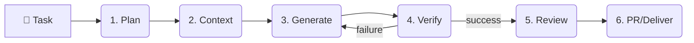
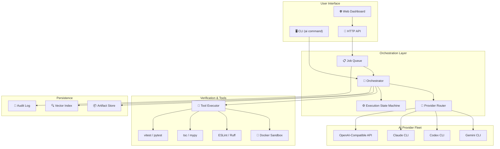
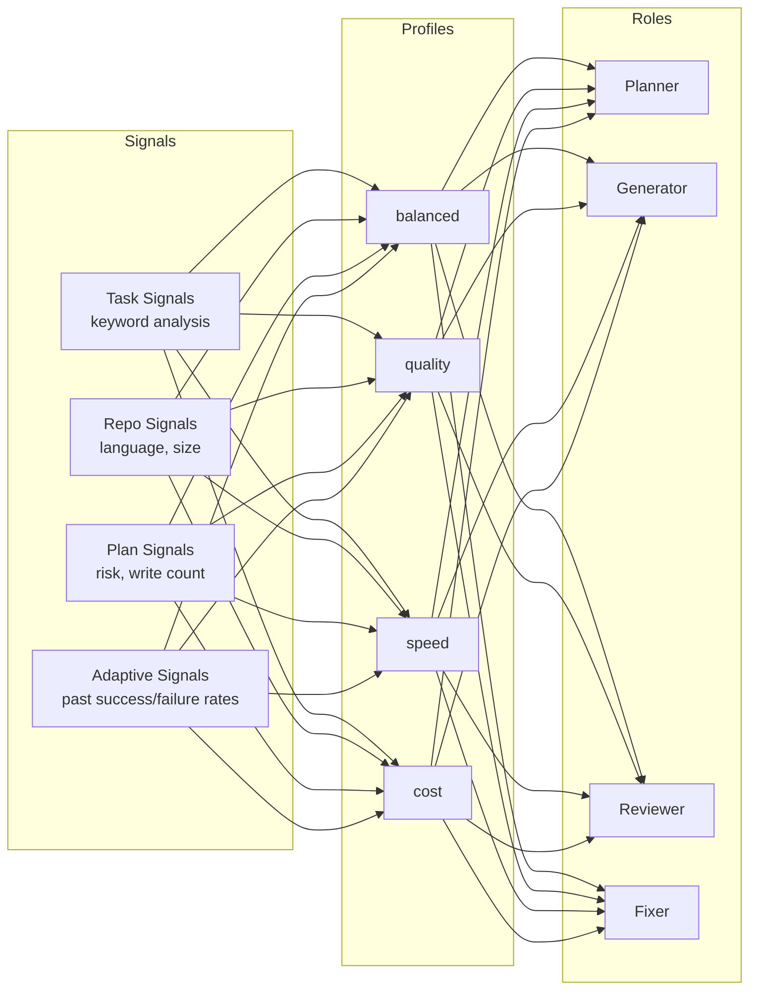
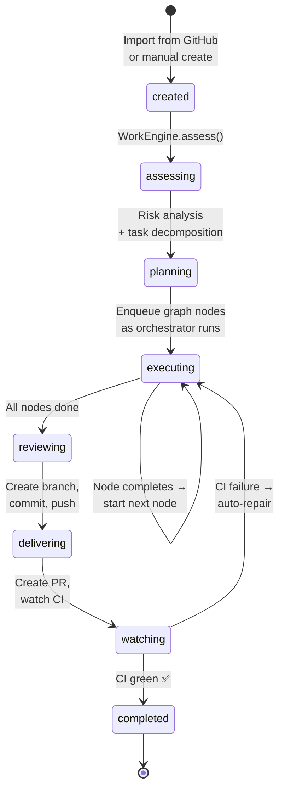

# Orchestra AI Platform

**Local-first control plane for AI coding agents.**

Turn Codex, Gemini, and Claude CLIs into a coordinated, governed coding workflow with planning, automated checks, self-repair loops, and human-in-the-loop approvals.

[](https://github.com/nghiant96/Orchestra-AI-Platform/actions/workflows/ci.yml)
[](docs/SECURITY.md)
[](https://nodejs.org)
[](https://opensource.org/licenses/MIT)

---

## Why Orchestra?

Most AI coding tools generate code and dump it on you. Orchestra is different — it's a **Work Execution Engine** that manages the entire lifecycle of an engineering task: from planning through verification to delivery.



### Key Differentiators

| Feature | Orchestra | Plain AI CLI |
|---|---|---|
| **Multi-provider routing** | Dynamically picks the best AI for each role | Single provider |
| **Automated verification** | Runs lint, typecheck, tests after every generation | Manual |
| **Self-repair loop** | Fails → re-generates → re-verifies (up to N iterations) | None |
| **Human-in-the-loop** | Approval gates, risk-based policies, pause checkpoints | None |
| **Artifact tracking** | Every iteration persisted, diff-aware, resumable | None |
| **Team control plane** | HTTP API, job queue, dashboard, audit log | Single user |
| **Workspace engine (Preview)** | Durable work items, branch tracking, PR planning | None |

---

## Architecture Overview

Orchestra does **not** generate code itself. It orchestrates a fleet of AI CLIs (Gemini, Codex, Claude) through standard streams (STDIN/STDOUT), assigning each a specialized role:



### How CLI Orchestration Works

Orchestra communicates with AI agents via **standard streams** — it doesn't use APIs; it spawns actual CLI processes:

```mermaid
sequenceDiagram
    participant O as Orchestrator
    participant R as Provider Router
    participant G as Gemini CLI
    participant C as Codex CLI
    participant CL as Claude CLI
    participant T as Tool Executor

    Note over O: Task received
    O->>R: Select providers for roles
    R-->>O: {planner: gemini, generator: codex, reviewer: claude}

    rect rgb(40, 40, 60)
        Note over O,G: Stage 1 — Planning
        O->>G: spawn gemini "Analyze repo and select files..."
        G-->>O: Plan {writeTargets, readFiles, risk}
    end

    Note over O: Context Intelligence expands file list<br/>Dependency graph + Vector search

    rect rgb(40, 60, 40)
        Note over O,C: Stage 2 — Generation
        O->>C: spawn codex "Generate implementation..." + context
        C-->>O: Generated files (full-file patches)
    end

    rect rgb(60, 40, 40)
        Note over O,T: Stage 3 — Verification Loop
        O->>T: Run lint, typecheck, test
        T-->>O: 2 lint errors, 1 type error

        Note over O: Iteration 2 — Self-repair
        O->>C: spawn codex "Fix these errors: ..." + failure logs
        C-->>O: Fixed files
        O->>T: Re-run checks
        T-->>O: All green ✅
    end

    rect rgb(40, 40, 80)
        Note over O,CL: Stage 4 — AI Review
        O->>CL: spawn claude "Review this code change..."
        CL-->>O: Review result {severity, issues[]}
    end

    Note over O: Human approval gate (if required)
    Note over O: Atomic file write / PR creation
```



### Provider Router — Intelligent Model Selection

The Provider Router dynamically picks the best AI for each role based on **signals** from the task, repository, and plan:



Each profile maps roles to specific providers. For example, `quality` might assign Claude as both reviewer and generator, while `speed` uses Gemini for everything.

---

## Workspace Engine — Durable Work Items (Experimental / v1.0 Roadmap)

> [!WARNING]
> **Status: Experimental Preview.** The Workspace Engine is currently in active development (Phase W1). While the data model, branch management, and PR planning are functional, advanced features like the dynamic Task Graph, Evidence Checklist, and full CI auto-repair loops are aspirational roadmap items planned for v1.0.

For multi-step engineering tasks, Orchestra provides an evolving **Workspace Engine** that goes beyond single-shot execution:



A Work Item contains:
- **Assessment (Roadmap)** — Risk level, complexity estimate, tier classification
- **Task Graph (Roadmap)** — DAG of execution nodes (inspect → implement → test → review)
- **Evidence Checklist (Roadmap)** — Each item requires proof before passing
- **Branch/PR State (Available)** — Tracks branch, commits, PR number, CI status

### Cost-Aware Execution Tiers

The Scheduler orders work by cost tier, running cheap tasks first:

| Tier | Examples | Provider Strategy |
|------|----------|-------------------|
| **Tier 0** | Config validation, schema checks | No LLM needed |
| **Tier 1** | Docs, README, comments | Cheapest provider |
| **Tier 2** | Standard implementation | Balanced profile |
| **Tier 3** | Security-critical, complex refactors | Quality profile |

---

## Quick Start

### 1. Prerequisites

```bash
# Required
node --version    # v20+
pnpm --version    # v8+

# At least one AI CLI installed and authenticated
gemini             # Google Gemini CLI
codex login        # OpenAI Codex CLI
claude             # Anthropic Claude CLI (optional)
```

### 2. Install

```bash
git clone https://github.com/nghiant96/Orchestra-AI-Platform.git
cd Orchestra-AI-Platform
pnpm install
```

### 3. Run a task

```bash
# One-shot task (dry-run by default — safe to try)
pnpm ai "Add error handling to the API client"

# Actually write files
pnpm ai "Add retry logic to HTTP calls" --no-dry-run

# Interactive session
pnpm ai:chat
```

### 4. Start the server + dashboard

```bash
# Terminal 1: Start the API server
pnpm run server

# Terminal 2: Start the dashboard
pnpm run dashboard:dev

# Or both at once:
pnpm run local:dev
```

Open **http://localhost:5173** to access the dashboard.
If you are running in server mode, place `AI_SYSTEM_SERVER_TOKEN` in the repo-root `.env` file so both the server and dashboard proxy use the same token.

---

## CLI Reference

### Core Commands

```bash
ai "task description"                 # Execute a coding task
ai implement "task description"       # Full implementation loop
ai review                             # Review current working tree changes
ai review --staged                    # Review only staged changes
ai review --files src/a.ts,src/b.ts   # Review specific files
ai fix                                # Interactive fix-focused flow
ai fix-checks                         # Run project checks + auto-repair
```

### Workspace Commands (Experimental Preview)

```bash
ai work list                          # List all work items
ai work create "task description"     # Create a new work item
ai work show <id>                     # Get work item details
ai work branch <id>                   # Create/sync git branch for work item
ai work commit <id>                   # Commit applied files to the branch
ai work pr <id>                       # Generate and preview GitHub PR
ai work ci watch <id>                 # Watch PR CI status
ai work metrics                       # Show workspace metrics
```

### Configuration & Diagnostics

```bash
ai setup                              # Interactive provider setup
ai doctor                             # Diagnose configuration issues
ai config show                        # Show effective configuration
ai config use <preset>                # Switch provider preset
ai runs list                          # Browse execution artifacts
ai retry last --stage reviewing       # Retry from a specific stage
```

### Environment Variables

| Variable | Description | Default |
|---|---|---|
| `AI_SYSTEM_PROVIDER` | Force a specific provider | Auto-detected |
| `AI_SYSTEM_ROUTING_PROFILE` | Force routing profile (`balanced`, `quality`, `speed`, `cost`) | `balanced` |
| `AI_SYSTEM_MEMORY` | Memory backend (`off`, `local-file`, `openmemory`) | `local-file` |
| `AI_SYSTEM_SANDBOX` | Sandbox mode (`inherit`, `clean`, `docker`) | `inherit` |
| `AI_SYSTEM_SERVER_TOKEN` | Bearer token for server auth | None |
| `AI_SYSTEM_DISABLE_TUI` | Disable interactive dashboard | `false` |

---

## Server API

When running as a team service, Orchestra exposes a RESTful HTTP API:

### Job Management

| Method | Endpoint | Description |
|---|---|---|
| `POST` | `/jobs` | Enqueue a task (returns 202) |
| `GET` | `/jobs` | List recent jobs |
| `GET` | `/jobs/:id` | Get job status, logs, result |
| `POST` | `/jobs/:id/cancel` | Cancel a running/queued job |
| `POST` | `/jobs/:id/approve` | Approve a paused job |
| `GET` | `/jobs/:id/stream` | SSE stream of job logs |

### Work Items

| Method | Endpoint | Description |
|---|---|---|
| `GET` | `/work-items` | List all work items |
| `POST` | `/work-items` | Create a work item |
| `GET` | `/work-items/:id` | Get work item detail |
| `POST` | `/work-items/:id/assess` | Run assessment |
| `POST` | `/work-items/:id/run` | Execute next graph node |
| `POST` | `/work-items/:id/cancel` | Cancel execution |
| `POST` | `/work-items/:id/handoff` | Create PR and hand off |

### Administration

| Method | Endpoint | Description |
|---|---|---|
| `GET` | `/health` | Server health + queue stats |
| `GET` | `/stats` | Analytics (cost, latency, failure rates) |
| `GET` | `/audit` | Audit log events |
| `GET` | `/audit/export` | Export audit as JSON/CSV |
| `POST` | `/queue/pause` | Pause job processing |
| `POST` | `/queue/resume` | Resume job processing |
| `POST` | `/config` | Update runtime configuration |

---

## Dashboard

The web dashboard provides real-time visibility into the system:

| Panel | Description |
|---|---|
| **Jobs** | Live job list with status, duration, provider metrics, approval controls |
| **Work Board** | Kanban view of work items with progress bars, branch/PR status |
| **Inbox** | Import GitHub issues/PRs as work items |
| **Analytics** | Cost tracking, failure classification, provider performance, queue latency |
| **Config** | Runtime configuration editor with risk policy visualization |
| **Job Detail** | Full execution timeline, iteration diffs, tool results, review history |
| **Work Item Detail** | 7-tab view: Assessment, Task Graph, Checklist, Runs, Branch/PR, CI Checks, Actions |

---

## Project Structure

```
orchestra-ai-platform/
├── ai-system/                    # Core platform source
│   ├── cli.ts                    # CLI entry point
│   ├── server.ts                 # Server entry point
│   ├── server-app.ts             # HTTP server factory
│   ├── types.ts                  # Shared type definitions
│   │
│   ├── cli/                      # CLI layer
│   │   ├── arg-parser.ts         # Argument parsing + validation
│   │   ├── presets.ts            # Provider preset management
│   │   ├── interactive.ts        # REPL / chat mode
│   │   ├── handlers/             # Command handlers
│   │   │   ├── task-handler.ts   # ai "task" / ai implement
│   │   │   ├── review-handler.ts # ai review
│   │   │   ├── fix-handler.ts    # ai fix / ai fix-checks
│   │   │   ├── config-handler.ts # ai config / ai setup / ai doctor
│   │   │   ├── runs-handler.ts   # ai runs list
│   │   │   └── work-handler.ts   # ai work (workspace commands)
│   │   └── formatters/           # Output formatting
│   │
│   ├── core/                     # Orchestration engine
│   │   ├── orchestrator.ts       # Orchestrator class (entry point)
│   │   ├── orchestrator-run.ts   # Run flow (plan → generate → verify → review)
│   │   ├── orchestrator-resume.ts# Resume from checkpoint
│   │   ├── orchestrator-runtime.ts# Runtime setup (config, providers, tools)
│   │   ├── run-executor.ts       # Iteration loop (generate → check → fix)
│   │   ├── execution-state-machine.ts # Stage transitions + timing
│   │   │
│   │   ├── provider-router.ts    # Signal-based provider selection
│   │   ├── provider-router-adaptive.ts # Learning from past runs
│   │   ├── provider-router-signals.ts  # Task/repo/plan signal builders
│   │   │
│   │   ├── tool-executor.ts      # Lint/typecheck/test runner
│   │   ├── tool-scoping.ts       # Changed-file scoping for checks
│   │   ├── tool-runner.ts        # Process spawning + output parsing
│   │   ├── tool-sandbox.ts       # Docker sandbox management
│   │   ├── tool-adapters.ts      # Project type detection
│   │   │
│   │   ├── context.ts            # File selection + ranking
│   │   ├── context-intelligence.ts # Dependency graph + semantic search
│   │   ├── vector-index.ts       # Local embedding index (@xenova)
│   │   ├── dependency-graph.ts   # Import graph analysis
│   │   │
│   │   ├── artifacts.ts          # Artifact store (barrel export)
│   │   ├── artifact-persistence.ts # Read/write/checkpoint
│   │   ├── artifact-query.ts     # Search/list/filter
│   │   │
│   │   ├── risk-policy.ts        # Risk assessment + approval rules
│   │   ├── reviewer.ts           # AI review orchestration
│   │   ├── current-change-review.ts # Working-tree review mode
│   │   │
│   │   ├── job-queue.ts          # File-backed job queue
│   │   ├── audit-log.ts          # File-backed audit log
│   │   ├── permissions.ts        # RBAC action permissions
│   │   ├── webhooks.ts           # Outbound webhook notifications
│   │   └── server-analytics.ts   # Cost/latency/failure analytics
│   │
│   ├── work/                     # Workspace engine
│   │   ├── work-engine.ts        # WorkEngine class (assess, plan, execute, PR)
│   │   ├── work-item.ts          # WorkItem data model
│   │   ├── work-store.ts         # File-backed work item persistence
│   │   ├── assessment.ts         # Risk/complexity/tier assessment
│   │   ├── task-graph.ts         # DAG templates (bugfix, feature, review, docs)
│   │   ├── checklist.ts          # Evidence-based checklist builder
│   │   ├── scheduler.ts          # Tier-aware execution ordering
│   │   ├── branch-manager.ts     # Git branch creation + safety
│   │   ├── commit-pr.ts          # Commit + PR body generation
│   │   ├── github-pr.ts          # gh CLI PR creation
│   │   ├── ci.ts                 # CI status polling (gh pr checks)
│   │   ├── inbox.ts              # GitHub URL import + dedup
│   │   └── worktree-cleanup.ts   # Git worktree lifecycle
│   │
│   ├── providers/                # AI provider adapters
│   │   ├── registry.ts           # Provider registry + detection
│   │   ├── gemini-cli.ts         # Google Gemini CLI adapter
│   │   ├── codex-cli.ts          # OpenAI Codex CLI adapter
│   │   ├── claude-cli.ts         # Anthropic Claude CLI adapter
│   │   └── openai-compatible.ts  # Generic OpenAI API adapter
│   │
│   ├── server/                   # HTTP route modules
│   │   ├── routes-context.ts     # Shared route types
│   │   └── routes/
│   │       ├── health.ts         # GET /health
│   │       ├── jobs.ts           # Job CRUD, SSE, approval
│   │       ├── config.ts         # Config read/update
│   │       ├── admin.ts          # Audit, queue control, stats
│   │       └── work-items.ts     # Work item CRUD, assess, run, handoff
│   │
│   ├── prompts/                  # AI prompt templates
│   ├── memory/                   # Conversation memory backends
│   ├── agents/                   # Agent definitions
│   ├── config/                   # Default configuration
│   └── utils/                    # Shared utilities
│
├── dashboard/                    # React + Vite web dashboard
│   └── src/
│       ├── App.tsx               # Main app shell + routing
│       ├── components/           # 28 React components
│       ├── hooks/                # Custom hooks (useJobs, useWorkItems, etc.)
│       └── types/                # TypeScript type definitions
│
├── tests/                        # Test suite (44 test files)
│   ├── tool-executor.test.ts     # Tool execution tests
│   ├── server-queue.test.ts      # Server + queue integration tests
│   ├── orchestrator.resume.test.ts # Resume/checkpoint tests
│   ├── workspace-baseline.test.ts # Workspace regression tests
│   ├── workspace-workflow.test.ts # Work item lifecycle tests
│   └── ...
│
├── docs/                         # Documentation
│   ├── ARCHITECTURE.md           # Deep architecture guide
│   ├── CLI.md                    # CLI reference
│   ├── CONFIG.md                 # Configuration guide
│   ├── SERVER.md                 # Server & API guide
│   ├── WORKSPACE.md              # Workspace engine guide
│   ├── OPERATIONS.md             # Operator runbook
│   ├── SECURITY.md               # Security policy
│   └── RELEASE_NOTES_v0.9.md    # Latest release notes
│
├── package.json                  # v0.9.0
├── tsconfig.json
├── Dockerfile
└── docker-compose.yml
```

---

## Safety & Reliability

| Feature | Description |
|---|---|
| **Dry-run by default** | Preview changes without touching a single file |
| **Artifact-backed** | Every iteration saved under `.ai-system-artifacts/` — rollback anytime |
| **Checkpoints** | Pause after planning or generation to verify intent |
| **Sandboxed execution** | Run project checks inside Docker for maximum isolation |
| **Risk policies** | Automatic risk assessment triggers stricter review for high-risk changes |
| **Audit log** | Every action (create, approve, cancel) is recorded with actor + timestamp |
| **Evidence-based checklist** | No checklist item passes without proof (run ID, commit SHA, PR URL) |
| **Atomic writes** | Files are written atomically — partial failures don't corrupt your codebase |

---

## Documentation

| Document | Description |
|---|---|
| 📖 [**Architecture Guide**](docs/ARCHITECTURE.md) | Role-based agents, CLI orchestration (STDIN/OUT), context intelligence |
| 💻 [**CLI Reference**](docs/CLI.md) | `ai`, `ai review`, `ai fix`, `ai work`, and all subcommands |
| ⚙️ [**Configuration**](docs/CONFIG.md) | `.ai-system.json`, provider presets, prompt customization |
| 🌐 [**Server & Dashboard**](docs/SERVER.md) | HTTP API, job queue, SSE streaming, Web UI |
| 🏢 [**Workspace Engine**](docs/WORKSPACE.md) | Work items, task graphs, PR automation, CI watch |
| 📋 [**Operator Runbook**](docs/OPERATIONS.md) | Production deployment, monitoring, troubleshooting |
| 🛡️ [**Security Policy**](docs/SECURITY.md) | Privacy, sandboxing, token-based auth, secret masking |
| 📝 [**Release Notes v0.9**](docs/RELEASE_NOTES_v0.9.md) | Latest changes and migration guide |

---

## Development

### Run tests

```bash
pnpm test                     # Run all tests
pnpm typecheck                # TypeScript checks (server + dashboard)
pnpm lint                     # ESLint
```

### Build dashboard

```bash
pnpm run dashboard:build      # Production build
```

### Docker

```bash
pnpm run docker:up            # Start in container
pnpm run docker:down          # Stop
pnpm run docker:logs          # Follow logs
```

---

## Contributing

1. Fork the repository
2. Create a feature branch (`git checkout -b feature/my-feature`)
3. Run the test suite to ensure nothing is broken (`pnpm test && pnpm typecheck && pnpm lint`)
4. Commit your changes with a clear message
5. Open a Pull Request

### Development conventions

- **TypeScript strict mode** — No `any` types; use `unknown` + type narrowing
- **File size limit** — Keep files under 500 lines; split into modules when approaching the limit
- **Test coverage** — Every new module should have corresponding test file in `tests/`
- **Artifact safety** — Never modify `.ai-system-artifacts/` directly; use the Artifact API

---

## Requirements

- **Node.js** 20+ (tested on Node 24)
- **pnpm** 8+
- At least one installed and authenticated AI CLI:
  - `gemini` — Google Gemini CLI
  - `codex` — OpenAI Codex CLI
  - `claude` — Anthropic Claude CLI
- **Docker** (optional) — For sandboxed tool execution
- **gh** CLI (optional) — For PR creation and CI status polling

---

## License

This project is licensed under the MIT License - see the [LICENSE](LICENSE) file for details.
