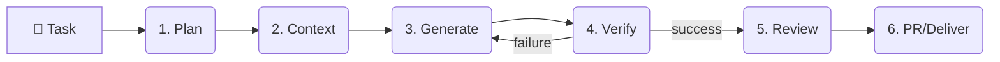
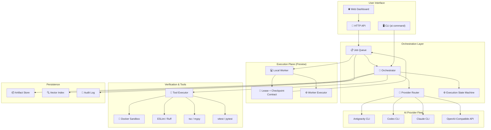
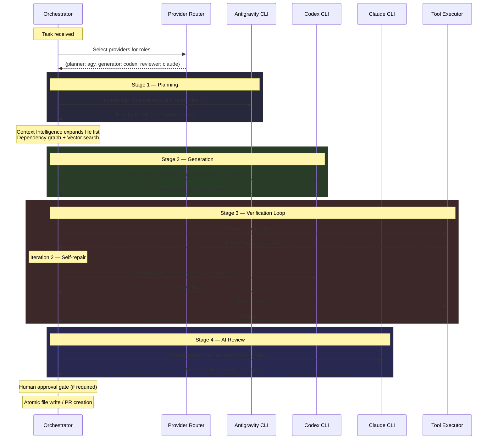
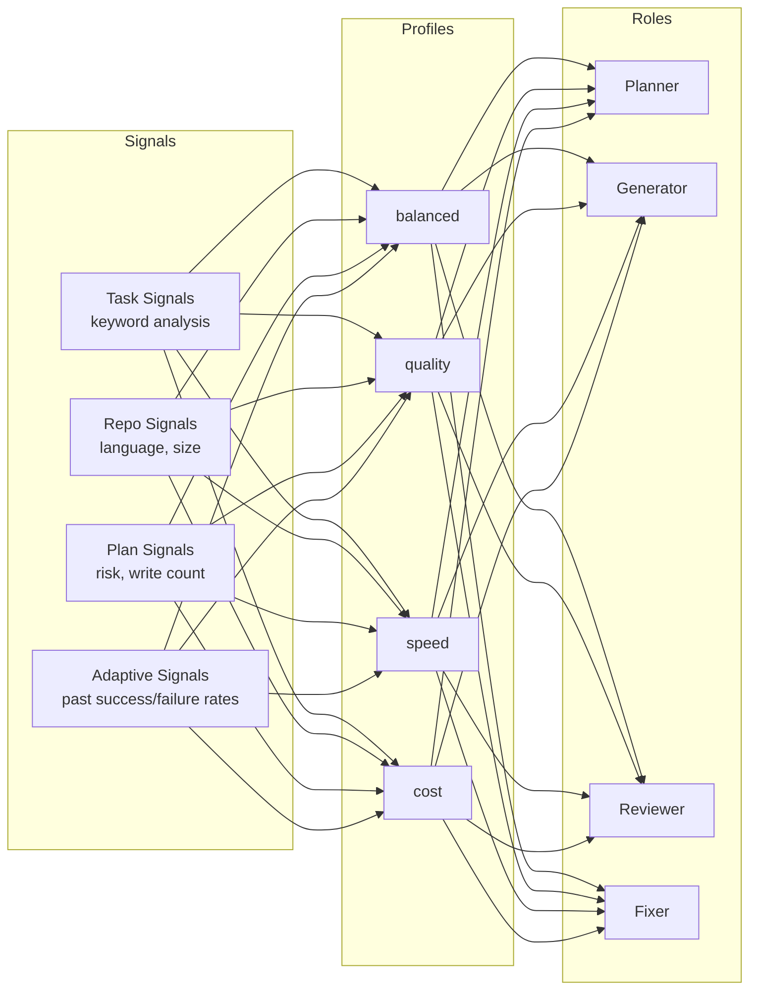
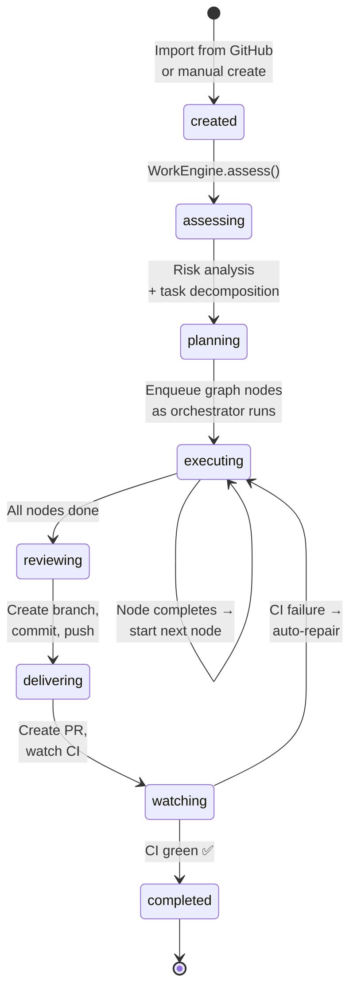

# Orchestra AI Platform

**Local-first control plane for AI coding agents.**

Turn Codex, Antigravity, and Claude CLIs into a coordinated, governed coding workflow with planning, automated checks, self-repair loops, and human-in-the-loop approvals.

Recent preview tracks add a server/worker execution plane, Hermes-facing MCP tools, and Superpowers workflow profiles. The control-plane contracts are implemented, while provider-backed worker execution remains alpha and should be treated as preview.

[](https://github.com/nghiant96/Orchestra-AI-Platform/actions/workflows/ci.yml)
[](docs/SECURITY.md)
[](https://nodejs.org)
[](https://opensource.org/licenses/MIT)

---

## Why Orchestra?

Most AI coding tools generate code and dump it on you. Orchestra is different — it's a **Work Execution Engine** that manages the entire lifecycle of an engineering task: from planning through verification to delivery.


```mermaid
graph LR
    Task[🎯 Task] --> Plan(1. Plan)
    Plan --> Context(2. Context)
    Context --> Gen(3. Generate)
    Gen --> Verify(4. Verify)
    Verify -- failure --> Gen
    Verify -- success --> Review(5. Review)
    Review --> PR(6. PR/Deliver)
```

### Key Differentiators

| Feature | Orchestra | Plain AI CLI |
|---|---|---|
| **Multi-provider routing** | Dynamically picks the best AI for each role | Single provider |
| **Automated verification** | Runs lint, typecheck, tests after every generation | Manual |
| **Self-repair loop** | Fails → re-generates → re-verifies (up to N iterations) | None |
| **Human-in-the-loop** | Approval gates, risk-based policies, pause checkpoints | None |
| **Artifact tracking** | Every iteration persisted, diff-aware, resumable | None |
| **Team control plane** | HTTP API, job queue, dashboard, audit log | Single user |
| **Local worker backend (Preview)** | Lease-backed workers can claim queued jobs from the server | None |
| **Hermes/Superpowers (Preview)** | MCP tools, workflow profiles, approvals, lessons, and repo registry | None |
| **Workspace engine (Preview)** | Durable work items, branch tracking, PR planning | None |

---

## Architecture Overview

Orchestra does **not** generate code itself. It orchestrates a fleet of AI CLIs (Antigravity, Codex, Claude) through standard streams (STDIN/STDOUT), assigning each a specialized role:


```mermaid
graph TD
    subgraph "User Interface"
        CLI["🖥️ CLI (ai command)"]
        Dashboard["🌐 Web Dashboard"]
        API["📡 HTTP API"]
    end

    subgraph "Orchestration Layer"
        Orchestrator["🧠 Orchestrator"]
        Router["🔀 Provider Router"]
        ESM["⚙️ Execution State Machine"]
        Queue["📋 Job Queue"]
    end

    subgraph "Execution Plane (Preview)"
        Worker["💻 Local Worker"]
        Lease["🔐 Lease + Checkpoint Contract"]
        WorkerExec["⚙️ Worker Executor"]
    end

    subgraph "AI Provider Fleet"
        direction LR
        Agy["Antigravity CLI"]
        Codex["Codex CLI"]
        Claude["Claude CLI"]
        OpenAI["OpenAI-Compatible API"]
    end

    subgraph "Verification & Tools"
        ToolExec["🔧 Tool Executor"]
        Sandbox["🐳 Docker Sandbox"]
        Lint["ESLint / Ruff"]
        TypeCheck["tsc / mypy"]
        Tests["vitest / pytest"]
    end

    subgraph "Persistence"
        Artifacts["📦 Artifact Store"]
        VectorDB["🔍 Vector Index"]
        AuditLog["📝 Audit Log"]
    end

    CLI --> Orchestrator
    Dashboard --> API
    API --> Queue
    Queue --> Orchestrator
    Queue --> Worker
    Worker --> Lease
    Lease --> Queue
    Worker --> WorkerExec

    Orchestrator --> Router
    Orchestrator --> ESM
    Router --> Agy
    Router --> Codex
    Router --> Claude
    Router --> OpenAI

    Orchestrator --> ToolExec
    ToolExec --> Sandbox
    ToolExec --> Lint
    ToolExec --> TypeCheck
    ToolExec --> Tests

    Orchestrator --> Artifacts
    Orchestrator --> VectorDB
    Queue --> AuditLog
```

### Execution Backends

Orchestra can run jobs in three backend modes:

| Backend | Status | Behavior |
|---|---|---|
| `in-process` | Default | The server drains the file-backed queue and executes jobs with the existing orchestrator runner. |
| `worker` | Preview | The server acts as a control plane; local workers register, heartbeat, claim leases, upload logs/checkpoints, and complete/fail jobs. |
| `hybrid` | Reserved | Currently treated as worker-only so in-process execution and external workers never compete for the same job. |

Worker mode uses atomic claim semantics, lease-bound complete/fail calls, dry-run no-mutation rules, and canonical realpath validation for worker workspace roots.

### How CLI Orchestration Works

Orchestra communicates with AI agents via **standard streams** — it doesn't use APIs; it spawns actual CLI processes:


```mermaid
sequenceDiagram
    participant O as Orchestrator
    participant R as Provider Router
    participant A as Antigravity CLI
    participant C as Codex CLI
    participant CL as Claude CLI
    participant T as Tool Executor

    Note over O: Task received
    O->>R: Select providers for roles
    R-->>O: {planner: agy, generator: codex, reviewer: claude}

    rect rgb(40, 40, 60)
        Note over O,A: Stage 1 — Planning
        O->>A: spawn agy "Analyze repo and select files..."
        A-->>O: Plan {writeTargets, readFiles, risk}
    end

    Note over O: Context Intelligence expands file list<br/>Dependency graph + Vector search

    rect rgb(40, 60, 40)
        Note over O,C: Stage 2 — Generation
        O->>C: spawn codex "Generate implementation..." + context
        C-->>O: Generated files (full-file patches)
    end

    rect rgb(60, 40, 40)
        Note over O,T: Stage 3 — Verification Loop
        O->>T: Run lint, typecheck, test
        T-->>O: 2 lint errors, 1 type error

        Note over O: Iteration 2 — Self-repair
        O->>C: spawn codex "Fix these errors: ..." + failure logs
        C-->>O: Fixed files
        O->>T: Re-run checks
        T-->>O: All green ✅
    end

    rect rgb(40, 40, 80)
        Note over O,CL: Stage 4 — AI Review
        O->>CL: spawn claude "Review this code change..."
        CL-->>O: Review result {severity, issues[]}
    end

    Note over O: Human approval gate (if required)
    Note over O: Atomic file write / PR creation
```

### Provider Router — Intelligent Model Selection

The Provider Router dynamically picks the best AI for each role based on **signals** from the task, repository, and plan:


```mermaid
graph LR
    subgraph Signals
        TS[Task Signals<br/>keyword analysis]
        RS[Repo Signals<br/>language, size]
        PS[Plan Signals<br/>risk, write count]
        AS[Adaptive Signals<br/>past success/failure rates]
    end

    subgraph Profiles
        B[balanced]
        Q[quality]
        S[speed]
        C[cost]
    end

    subgraph Roles
        P[Planner]
        G[Generator]
        R[Reviewer]
        F[Fixer]
    end

    TS --> B & Q & S & C
    RS --> B & Q & S & C
    PS --> B & Q & S & C
    AS --> B & Q & S & C
    B --> P & G & R & F
    Q --> P & G & R & F
    S --> P & G & R & F
    C --> P & G & R & F
```

Each profile maps roles to specific providers. For example, `quality` might assign Claude as both reviewer and generator, while `speed` uses Antigravity for everything.

---

## Workspace Engine — Durable Work Items (Experimental / v1.0 Roadmap)

> [!WARNING]
> **Status: Experimental Preview.** Durable work items, branch/PR state, worker-aware job links, Superpowers workflow profiles, and lesson export are available. Full provider-backed worker execution, dynamic task graphs, and CI auto-repair loops are still roadmap/alpha areas.

For multi-step engineering tasks, Orchestra provides an evolving **Workspace Engine** that goes beyond single-shot execution:


```mermaid
stateDiagram-v2
    [*] --> created: Import from GitHub<br/>or manual create
    created --> assessing: WorkEngine.assess()
    assessing --> planning: Risk analysis<br/>+ task decomposition
    planning --> executing: Enqueue graph nodes<br/>as orchestrator runs
    executing --> executing: Node completes →<br/>start next node
    executing --> reviewing: All nodes done
    reviewing --> delivering: Create branch,<br/>commit, push
    delivering --> watching: Create PR,<br/>watch CI
    watching --> completed: CI green ✅
    watching --> executing: CI failure →<br/>auto-repair
    completed --> [*]
```

A Work Item contains:
- **Assessment (Roadmap)** — Risk level, complexity estimate, tier classification
- **Task Graph (Roadmap)** — DAG of execution nodes (inspect → implement → test → review)
- **Evidence Checklist (Roadmap)** — Each item requires proof before passing
- **Branch/PR State (Available)** — Tracks branch, commits, PR number, CI status

### Cost-Aware Execution Tiers

The Scheduler orders work by cost tier, running cheap tasks first:

| Tier | Examples | Provider Strategy |
|------|----------|-------------------|
| **Tier 0** | Config validation, schema checks | No LLM needed |
| **Tier 1** | Docs, README, comments | Cheapest provider |
| **Tier 2** | Standard implementation | Balanced profile |
| **Tier 3** | Security-critical, complex refactors | Quality profile |

---

## Quick Start

### 1. Prerequisites

```bash
# Required
node --version    # v20+
pnpm --version    # v8+

# At least one AI CLI installed and authenticated
agy                # Antigravity CLI (recommended)
codex login        # OpenAI Codex CLI
claude             # Anthropic Claude CLI (optional)
```

### 2. Install

```bash
git clone https://github.com/nghiant96/Orchestra-AI-Platform.git
cd Orchestra-AI-Platform
pnpm install
```

### 3. Run a task

```bash
# One-shot task (dry-run by default — safe to try)
pnpm ai "Add error handling to the API client"

# Actually write files
pnpm ai "Add retry logic to HTTP calls" --no-dry-run

# Interactive session
pnpm ai:chat
```

### 4. Start the server + dashboard

```bash
# Terminal 1: Start the API server
pnpm run server

# Terminal 2: Start the dashboard
pnpm run dashboard:dev

# Or both at once:
pnpm run local:dev
```

Open **http://localhost:5253** to access the dashboard.
If you are running in server mode, place `AI_SYSTEM_SERVER_TOKEN` in the repo-root `.env` file so both the server and dashboard proxy use the same token.

### 5. Start the local worker backend (Preview)

Use worker mode when you want the server to own queue/control-plane state while a local machine executes claimed jobs.

```bash
# Terminal 1: server as control plane
AI_SYSTEM_SERVER_MODE=true \
AI_SYSTEM_SERVER_TOKEN=dev-token \
AI_SYSTEM_ALLOWED_WORKDIRS="$PWD" \
ORCHESTRA_EXECUTION_BACKEND=worker \
ORCHESTRA_WORKER_TOKEN=worker-token \
pnpm run server

# Terminal 2: local worker
pnpm ai worker start \
  --server-url http://127.0.0.1:3927 \
  --token worker-token \
  --name local-worker \
  --labels local,dev \
  --workspace-roots "$PWD"
```

Worker registration validates `workspaceRoots` with canonical realpath checks. A symlink that resolves outside `AI_SYSTEM_ALLOWED_WORKDIRS` is rejected. Jobs marked `dryRun=true` must not mutate files or write mutation checkpoints.

---

## CLI Reference

### Core Commands

```bash
ai "task description"                 # Execute a coding task
ai implement "task description"       # Full implementation loop
ai review                             # Review current working tree changes
ai review --staged                    # Review only staged changes
ai review --files src/a.ts,src/b.ts   # Review specific files
ai fix                                # Interactive fix-focused flow
ai fix-checks                         # Run project checks + auto-repair
```

### Workspace Commands (Experimental Preview)

```bash
ai work list                          # List all work items
ai work create "task description"     # Create a new work item
ai work show <id>                     # Get work item details
ai work branch <id>                   # Create/sync git branch for work item
ai work commit <id>                   # Commit applied files to the branch
ai work pr <id>                       # Generate and preview GitHub PR
ai work ci watch <id>                 # Watch PR CI status
ai work metrics                       # Show workspace metrics
```

### Configuration & Diagnostics

```bash
ai setup                              # Interactive provider setup
ai doctor                             # Diagnose configuration issues
ai config show                        # Show effective configuration
ai config use <preset>                # Switch provider preset
ai runs list                          # Browse execution artifacts
ai retry last --stage reviewing       # Retry from a specific stage
```

### Local Worker Commands (Preview)

```bash
ai worker start                       # Register, heartbeat, poll, claim, execute
ai worker start --once                # Register and run one poll/claim cycle
ai worker start \
  --server-url http://127.0.0.1:3927 \
  --token "$ORCHESTRA_WORKER_TOKEN" \
  --workspace-roots /allowed/root
```

### Environment Variables

| Variable | Description | Default |
|---|---|---|
| `AI_SYSTEM_PROVIDER` | Force a specific provider | Auto-detected |
| `AI_SYSTEM_ROUTING_PROFILE` | Force routing profile (`balanced`, `quality`, `speed`, `cost`) | `balanced` |
| `AI_SYSTEM_MEMORY` | Memory backend (`off`, `local-file`, `openmemory`) | `local-file` |
| `AI_SYSTEM_SANDBOX` | Sandbox mode (`inherit`, `clean`, `docker`) | `inherit` |
| `AI_SYSTEM_SERVER_TOKEN` | Bearer token for server auth | None |
| `AI_SYSTEM_ALLOWED_WORKDIRS` | Comma-separated workspace roots the server may operate in | Current working directory |
| `ORCHESTRA_EXECUTION_BACKEND` | Queue execution owner: `in-process`, `worker`, `hybrid` | `in-process` |
| `ORCHESTRA_WORKER_TOKEN` | Bearer token for worker register/heartbeat/claim/complete APIs | None |
| `ORCHESTRA_HERMES_TOKEN` | Bearer token for Hermes/MCP-facing APIs | None |
| `ORCHESTRA_SERVER_URL` | Default server URL for `ai worker start` | `http://127.0.0.1:3927` |
| `ORCHESTRA_WORKSPACE_ROOTS` | Default comma-separated worker roots for `ai worker start` | Current working directory |
| `AI_SYSTEM_DISABLE_TUI` | Disable interactive dashboard | `false` |

---

## Server API

When running as a team service, Orchestra exposes a RESTful HTTP API:

### Job Management

| Method | Endpoint | Description |
|---|---|---|
| `POST` | `/jobs` | Enqueue a task (returns 202) |
| `GET` | `/jobs` | List recent jobs |
| `GET` | `/jobs/:id` | Get job status, logs, result |
| `POST` | `/jobs/:id/cancel` | Cancel a running/queued job |
| `POST` | `/jobs/:id/approve` | Approve a paused job |
| `GET` | `/jobs/:id/stream` | SSE stream of job logs |

### Work Items

| Method | Endpoint | Description |
|---|---|---|
| `GET` | `/work-items` | List all work items |
| `POST` | `/work-items` | Create a work item |
| `GET` | `/work-items/:id` | Get work item detail |
| `POST` | `/work-items/:id/assess` | Run assessment |
| `POST` | `/work-items/:id/run` | Execute next graph node |
| `POST` | `/work-items/:id/cancel` | Cancel execution |
| `POST` | `/work-items/:id/handoff` | Create PR and hand off |

### Workspaces & Repo Registry

| Method | Endpoint | Description |
|---|---|---|
| `GET` | `/workspaces` | List allowed workspace roots |
| `POST` | `/workspaces` | Register an additional workspace root after realpath validation |
| `GET` | `/repos` | List registered repositories |
| `POST` | `/repos` | Register a repository mapping for work items/Hermes |

### Local Workers (Preview)

| Method | Endpoint | Description |
|---|---|---|
| `GET` | `/workers` | List registered workers |
| `POST` | `/workers` | Register a worker and return its bootstrap session token |
| `GET` | `/workers/:id` | Get worker detail without exposing the session token |
| `POST` | `/workers/:id/heartbeat` | Update worker status and renew active lease |
| `POST` | `/workers/:id/disable` | Disable a worker |
| `POST` | `/workers/:id/enable` | Enable a worker |
| `POST` | `/workers/:id/drain` | Drain a worker without accepting new jobs |
| `POST` | `/workers/:id/jobs/claim` | Claim one eligible queued job with an atomic lease |
| `POST` | `/workers/:id/jobs/:jobId/logs` | Upload redacted worker logs |
| `POST` | `/jobs/:jobId/checkpoint` | Save a mutation checkpoint for an active lease |
| `POST` | `/jobs/:jobId/complete` | Complete a leased job and persist result payload |
| `POST` | `/jobs/:jobId/fail` | Fail a leased job and persist failure payload |
| `POST` | `/jobs/:jobId/recover` | Manually recover a stalled job |

### Administration

| Method | Endpoint | Description |
|---|---|---|
| `GET` | `/health` | Server health + queue stats |
| `GET` | `/stats` | Analytics (cost, latency, failure rates) |
| `GET` | `/audit` | Audit log events |
| `GET` | `/audit/export` | Export audit as JSON/CSV |
| `POST` | `/queue/pause` | Pause job processing |
| `POST` | `/queue/resume` | Resume job processing |
| `POST` | `/config` | Update runtime configuration |

---

## Dashboard

The web dashboard provides real-time visibility into the system:

| Panel | Description |
|---|---|
| **Jobs** | Live job list with status, duration, provider metrics, approval controls |
| **Work Board** | Kanban view of work items with progress bars, branch/PR status |
| **Workers** | Worker status, current job, labels, capabilities, drain/disable controls |
| **Approvals & Artifacts** | Approval gates, artifact binding, diff summaries, and result payloads |
| **Inbox** | Import GitHub issues/PRs as work items |
| **Analytics** | Cost tracking, failure classification, provider performance, queue latency |
| **Config** | Runtime configuration editor with risk policy visualization |
| **Job Detail** | Full execution timeline, iteration diffs, tool results, review history |
| **Work Item Detail** | 7-tab view: Assessment, Task Graph, Checklist, Runs, Branch/PR, CI Checks, Actions |

---

## Project Structure

```
orchestra-ai-platform/
├── ai-system/                        # Core platform source
│   ├── cli.ts                        # CLI entry point
│   ├── server.ts                     # Server entry point
│   ├── server-app.ts                 # HTTP server factory
│   ├── types.ts                      # Shared type definitions
│   │
│   ├── cli/                          # CLI layer
│   │   ├── arg-parser.ts             # Argument parsing + validation
│   │   ├── presets.ts                # Provider preset management
│   │   ├── interactive.ts            # REPL / chat mode
│   │   ├── setup.ts                  # Interactive setup wizard
│   │   ├── handlers/                 # Command handlers
│   │   │   ├── task-handler.ts       # ai "task" / ai implement
│   │   │   ├── review-handler.ts     # ai review
│   │   │   ├── fix-handler.ts        # ai fix / ai fix-checks
│   │   │   ├── config-handler.ts     # ai config / ai setup / ai doctor
│   │   │   ├── runs-handler.ts       # ai runs list
│   │   │   └── work-handler.ts       # ai work (workspace commands)
│   │   └── formatters/               # Output formatting
│   │
│   ├── core/                         # Orchestration engine
│   │   ├── orchestrator.ts           # Orchestrator class (entry point)
│   │   ├── orchestrator-run.ts       # Run flow (plan → generate → verify → review)
│   │   ├── orchestrator-shared.ts    # Shared orchestration utilities
│   │   ├── orchestrator-resume.ts    # Resume from checkpoint
│   │   ├── orchestrator-runtime.ts   # Runtime setup (config, providers, tools)
│   │   ├── orchestrator-confirmation.ts # Human-in-the-loop approval gates
│   │   ├── run-executor.ts           # Iteration loop (generate → check → fix)
│   │   ├── execution-state-machine.ts # Stage transitions + timing
│   │   ├── execution-summary.ts      # Run summary + metrics
│   │   │
│   │   ├── provider-router.ts        # Signal-based provider selection
│   │   ├── provider-router-adaptive.ts # Learning from past runs
│   │   ├── provider-router-signals.ts # Task/repo/plan signal builders
│   │   ├── provider-router-utils.ts   # Provider utility functions
│   │   │
│   │   ├── tool-executor.ts          # Lint/typecheck/test runner
│   │   ├── tool-scoping.ts           # Changed-file scoping for checks
│   │   ├── tool-runner.ts            # Process spawning + output parsing
│   │   ├── tool-sandbox.ts           # Docker sandbox management
│   │   ├── tool-adapters.ts          # Project type detection
│   │   ├── builtin-tool-adapters.ts  # Built-in tool configurations
│   │   │
│   │   ├── context.ts                # File selection + ranking
│   │   ├── context-intelligence.ts   # Dependency graph + semantic search
│   │   ├── vector-index.ts           # Local embedding index (@xenova)
│   │   ├── dependency-graph.ts       # Import graph analysis
│   │   │
│   │   ├── artifacts.ts              # Artifact store (barrel export)
│   │   ├── artifact-persistence.ts   # Read/write/checkpoint
│   │   ├── artifact-query.ts         # Search/list/filter
│   │   ├── artifact-types.ts         # Artifact type definitions
│   │   ├── artifact-utils.ts         # Artifact utility functions
│   │   ├── artifact-apply.ts         # Atomic file write + apply
│   │   │
│   │   ├── risk-policy.ts            # Risk assessment + approval rules
│   │   ├── reviewer.ts               # AI review orchestration
│   │   ├── current-change-review.ts  # Working-tree review mode
│   │   ├── review-failing-checks.ts  # Failed check analysis
│   │   │
│   │   ├── job-queue.ts              # File-backed job queue
│   │   ├── execution-backend.ts      # in-process / worker / hybrid backend selection
│   │   ├── workspace-registry.ts     # Allowed workspace root persistence + validation
│   │   ├── audit-log.ts              # File-backed audit log
│   │   ├── permissions.ts            # RBAC action permissions
│   │   ├── webhooks.ts               # Outbound webhook notifications
│   │   ├── server-analytics.ts       # Cost/latency/failure analytics
│   │   │
│   │   ├── task-requirements.ts      # Task requirement analysis
│   │   ├── test-heuristics.ts        # Test generation heuristics
│   │   ├── test-reconciliation.ts    # Test reconciliation utilities
│   │   ├── blast-radius.ts           # Change impact analysis
│   │   ├── refactor-analysis.ts      # Refactoring analysis
│   │   ├── fix-checks.ts             # Automated fix checks
│   │   ├── fix-from-run.ts           # Fix from previous run
│   │   ├── git-workflow.ts           # Git workflow integration
│   │   ├── manual-checkpoints.ts     # Manual checkpoint management
│   │   ├── config-workflow.ts        # Config-driven workflow
│   │   ├── external-task.ts          # External task integration
│   │   ├── lessons.ts                # Lessons learned management
│   │   ├── normalizers.ts            # Data normalization
│   │   ├── plugins.ts                # Plugin system
│   │   ├── project-registry.ts       # Multi-project registry
│   │   ├── symbol-parsers.ts         # Code symbol parsing
│   │   ├── workflow-modes.ts         # Workflow mode definitions
│   │   └── extractors/               # Code extractors (API, config, tests, etc.)
│   │
│   ├── work/                         # Workspace engine (Preview / v1.0 Roadmap)
│   │   ├── work-engine.ts            # WorkEngine class (assess, plan, execute, PR)
│   │   ├── work-item.ts              # WorkItem data model
│   │   ├── work-store.ts             # File-backed work item persistence
│   │   ├── index.ts                  # Barrel export
│   │   ├── assessment.ts             # Risk/complexity/tier assessment
│   │   ├── task-graph.ts             # DAG templates (bugfix, feature, review, docs)
│   │   ├── checklist.ts              # Evidence-based checklist builder
│   │   ├── scheduler.ts              # Tier-aware execution ordering
│   │   ├── branch-manager.ts         # Git branch creation + safety
│   │   ├── worktree-manager.ts       # Git worktree lifecycle
│   │   ├── worktree-cleanup.ts       # Git worktree cleanup
│   │   ├── commit-pr.ts              # Commit + PR body generation
│   │   ├── github-pr.ts              # gh CLI PR creation
│   │   ├── ci.ts                     # CI status polling (gh pr checks)
│   │   ├── inbox.ts                  # GitHub URL import + dedup
│   │   └── normalizers.ts            # Work item data normalization
│   │
│   ├── worker/                       # Local worker runtime/CLI loop (Preview)
│   │   ├── worker-client.ts          # Worker HTTP client
│   │   ├── worker-loop.ts            # Register, heartbeat, claim, execute loop
│   │   ├── worker-config.ts          # Worker env/CLI config loader
│   │   └── job-executor.ts           # Preview worker job executor
│   │
│   ├── workers/                      # Server-side worker registry and lease service
│   │   ├── worker-types.ts           # Worker data model
│   │   ├── worker-store.ts           # File-backed worker store
│   │   ├── worker-service.ts         # Claim/lease/checkpoint/complete contracts
│   │   └── worker-routes.ts          # Worker HTTP API
│   │
│   ├── jobs/                         # Job service wrappers for routes/MCP
│   ├── approvals/                    # Approval service and artifact binding
│   ├── repos/                        # Repo registry for Hermes/work items
│   ├── mcp/                          # Hermes-facing MCP server/tools
│   ├── security/                     # Token auth, path policy, redaction, command policy
│   ├── workflows/                    # Workflow profiles including Superpowers
│   │
│   ├── providers/                    # AI provider adapters
│   │   ├── registry.ts               # Provider registry + detection
│   │   ├── agy-cli.ts                # Antigravity CLI adapter
│   │   ├── codex-cli.ts              # OpenAI Codex CLI adapter
│   │   ├── claude-cli.ts             # Anthropic Claude CLI adapter
│   │   └── openai-compatible.ts      # Generic OpenAI API adapter
│   │
│   ├── server/                       # HTTP route modules
│   │   ├── routes-context.ts         # Shared route types
│   │   └── routes/
│   │       ├── health.ts             # GET /health
│   │       ├── jobs.ts               # Job CRUD, SSE, approval
│   │       ├── config.ts             # Config read/update
│   │       ├── admin.ts              # Audit, queue control, stats
│   │       └── work-items.ts         # Work item CRUD, assess, run, handoff
│   │
│   ├── prompts/                      # AI prompt templates
│   ├── memory/                       # Conversation memory backends
│   ├── agents/                       # Agent definitions (planner, generator, fixer, reviewer)
│   ├── config/                       # Default configuration (rules.json)
│   └── utils/                        # Shared utilities (logger, schema, config, etc.)
│
├── dashboard/                        # React + Vite web dashboard
│   └── src/
│       ├── App.tsx                   # Main app shell + routing
│       ├── components/               # React components
│       ├── hooks/                    # Custom hooks (useJobs, useWorkItems, etc.)
│       └── types/                    # TypeScript type definitions
│
├── tests/                            # Test suite
│   ├── tool-executor.test.ts         # Tool execution tests
│   ├── server-queue.test.ts          # Server + queue integration tests
│   ├── orchestrator.resume.test.ts   # Resume/checkpoint tests
│   └── ...
│
├── docs/                             # Documentation
│   ├── ARCHITECTURE.md               # Deep architecture guide
│   ├── CLI.md                        # CLI reference
│   ├── CONFIG.md                     # Configuration guide
│   ├── SERVER.md                     # Server & API guide
│   ├── WORKSPACE.md                  # Workspace engine guide
│   ├── OPERATIONS.md                 # Operator runbook
│   ├── SECURITY.md                   # Security policy
│   └── RELEASE_NOTES_v0.9.md        # Latest release notes
│
├── tasks/                            # Project management
│   ├── todo.md                       # Current task tracking
│   ├── roadmap.md                    # Feature roadmap
│   ├── lessons.md                    # Lessons learned
│   └── ...
│
├── package.json                      # v0.9.0
├── tsconfig.json
├── Dockerfile
└── docker-compose.yml
```

---

## Safety & Reliability

| Feature | Description |
|---|---|
| **Dry-run by default** | Preview changes without touching a single file |
| **Artifact-backed** | Every iteration saved under `.ai-system-artifacts/` — rollback anytime |
| **Checkpoints** | Pause after planning or generation to verify intent |
| **Sandboxed execution** | Run project checks inside Docker for maximum isolation |
| **Risk policies** | Automatic risk assessment triggers stricter review for high-risk changes |
| **Audit log** | Every action (create, approve, cancel) is recorded with actor + timestamp |
| **Evidence-based checklist** | No checklist item passes without proof (run ID, commit SHA, PR URL) |
| **Atomic writes** | Files are written atomically — partial failures don't corrupt your codebase |
| **Lease-backed workers** | Worker claims are atomic and complete/fail requires a valid lease |
| **Workspace root guards** | Workspace and worker roots are validated through canonical realpaths |

---

## Documentation

| Document | Description |
|---|---|
| 📖 [**Architecture Guide**](docs/ARCHITECTURE.md) | Role-based agents, CLI orchestration (STDIN/OUT), context intelligence |
| 💻 [**CLI Reference**](docs/CLI.md) | `ai`, `ai review`, `ai fix`, `ai work`, and all subcommands |
| ⚙️ [**Configuration**](docs/CONFIG.md) | `.ai-system.json`, provider presets, prompt customization |
| 🌐 [**Server & Dashboard**](docs/SERVER.md) | HTTP API, job queue, SSE streaming, Web UI |
| 🏢 [**Workspace Engine**](docs/WORKSPACE.md) | Work items, task graphs, PR automation, CI watch |
| 📋 [**Operator Runbook**](docs/OPERATIONS.md) | Production deployment, monitoring, troubleshooting |
| 🛡️ [**Security Policy**](docs/SECURITY.md) | Privacy, sandboxing, token-based auth, secret masking |
| 🧭 [**Hermes + Superpowers Plan**](tasks/hermes-superpowers-implementation-plan.md) | Phase checklist and implementation status for worker/Hermes/Superpowers tracks |
| 🏗️ [**Hermes Architecture**](ORCHESTRA_HERMES_SUPERPOWERS_ARCHITECTURE.md) | Control-plane, worker, MCP, and Superpowers architecture |
| 📝 [**Release Notes v0.9**](docs/RELEASE_NOTES_v0.9.md) | Latest changes and migration guide |

---

## Development

### Run tests

```bash
pnpm test                     # Run all tests
pnpm typecheck                # TypeScript checks (server + dashboard)
pnpm lint                     # ESLint
```

### Build dashboard

```bash
pnpm run dashboard:build      # Production build (output to dashboard/dist/)
```

### Start dashboard (dev)

```bash
pnpm run dashboard:dev        # Dev server on http://localhost:5253
```

### Docker

```bash
pnpm run docker:up            # Start in container
pnpm run docker:down          # Stop
pnpm run docker:logs          # Follow logs
```

---

## Contributing

1. Fork the repository
2. Create a feature branch (`git checkout -b feature/my-feature`)
3. Run the test suite to ensure nothing is broken (`pnpm test && pnpm typecheck && pnpm lint`)
4. Commit your changes with a clear message
5. Open a Pull Request

### Development conventions

- **TypeScript strict mode** — No `any` types; use `unknown` + type narrowing
- **File size limit** — Keep files under 500 lines; split into modules when approaching the limit
- **Test coverage** — Every new module should have corresponding test file in `tests/`
- **Artifact safety** — Never modify `.ai-system-artifacts/` directly; use the Artifact API

---

## Requirements

- **Node.js** 20+ (tested on Node 24)
- **pnpm** 8+
- At least one installed and authenticated AI CLI:
  - `agy` — Antigravity CLI
  - `codex` — OpenAI Codex CLI
  - `claude` — Anthropic Claude CLI
- **Docker** (optional) — For sandboxed tool execution
- **gh** CLI (optional) — For PR creation and CI status polling

---

## License

This project is licensed under the MIT License - see the [LICENSE](LICENSE) file for details.
