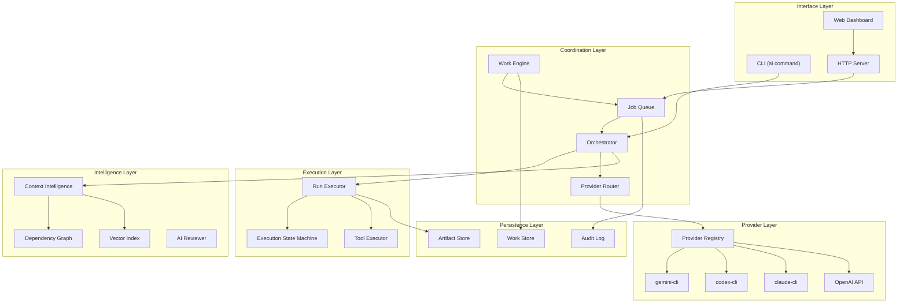
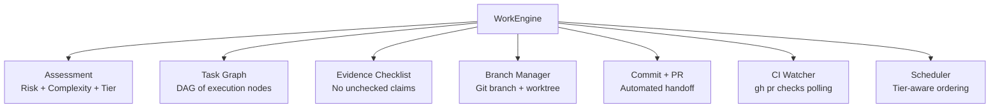
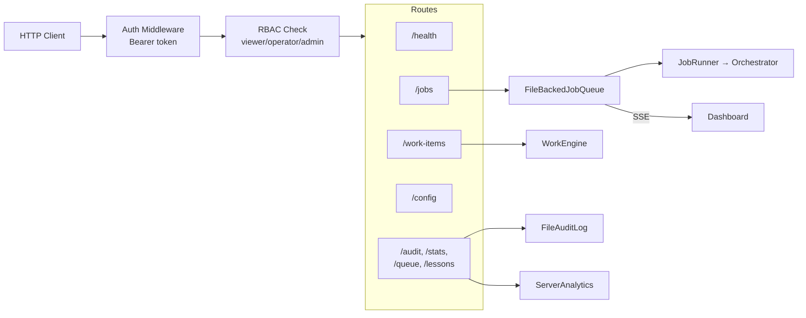

# Architecture Guide

Orchestra operates as a **role-based orchestration engine**. It does not generate code itself; instead, it coordinates a fleet of specialized AI "workers" (CLIs) to complete complex software engineering tasks through a structured pipeline.

---

## System Layers



---

## Operational Workflow — Single Task

The following sequence diagram shows how Orchestra processes a single coding task from intake to delivery:

```mermaid
sequenceDiagram
    participant U as User
    participant O as Orchestrator
    participant R as Provider Router
    participant P as Planner (Gemini)
    participant CI as Context Intelligence
    participant G as Generator (Codex)
    participant T as Tool Executor
    participant RV as Reviewer (Claude)
    participant A as Artifact Store

    U->>O: "Add retry logic to API client"
    O->>A: Create run artifact directory

    rect rgb(40, 50, 70)
        Note over O,P: Stage 1 — Planning
        O->>R: buildRoutingDecision(stage: planning)
        R-->>O: {planner: gemini-cli}
        O->>P: spawn gemini "Analyze repo structure..."
        P-->>O: Plan {writeTargets: [api.ts], readFiles: [...], risk: medium}
        O->>A: Persist plan checkpoint
    end

    rect rgb(40, 60, 50)
        Note over O,CI: Stage 2 — Context Assembly
        O->>CI: expandContext(plan)
        CI->>CI: Parse imports → dependency graph
        CI->>CI: Vector similarity search
        CI-->>O: Ranked file list (write targets + deps + semantic matches)
    end

    rect rgb(50, 50, 40)
        Note over O,G: Stage 3 — Generation + Verification Loop
        O->>R: buildRoutingDecision(stage: implementation)
        R-->>O: {generator: codex-cli, reviewer: claude-cli, fixer: codex-cli}

        loop Up to maxIterations (default 5)
            O->>G: spawn codex "Generate code..." + context
            G-->>O: Generated files [{path, content}]
            O->>T: runToolChecks(lint, typecheck, test)
            alt Checks pass
                Note over O: Break loop ✅
            else Checks fail
                O->>G: spawn codex "Fix: ..." + failure logs
            end
        end
    end

    rect rgb(50, 40, 60)
        Note over O,RV: Stage 4 — Review
        O->>RV: spawn claude "Review this diff..."
        RV-->>O: Review {issues[], severity, verdict}
    end

    O->>A: Persist final run state
    O-->>U: Result {ok, files, review, execution summary}
```



---

## Core Components

### 1. Orchestrator (`orchestrator.ts`)

The central class that manages the task lifecycle. It delegates to specialized modules:

- **`orchestrator-run.ts`** — Fresh run flow: config → plan → context → generate → verify → review
- **`orchestrator-resume.ts`** — Resume from any checkpoint (paused-after-plan, paused-after-generate)
- **`orchestrator-runtime.ts`** — Runtime setup: load config, resolve providers, initialize tools

### 2. Provider Router (`provider-router.ts`)

Dynamically selects the best AI provider for each role based on weighted signals:

```
Score = Σ (signal.weight × signal.match)
Profile = argmax(balanced, quality, speed, cost)
```

**Signal sources:**
- **Task signals** — Keywords like "security" boost quality; "docs" boost speed
- **Repo signals** — Language, monorepo vs single-project, file count
- **Plan signals** — Risk level, write target count, docs-only changes
- **Adaptive signals** — Historical success/failure rates per provider

Each profile maps roles to concrete providers:
- `balanced` → Gemini for planning, Codex for generation, Claude for review
- `quality` → Claude for all roles
- `speed` → Gemini for all roles
- `cost` → Cheapest available for each role

### 3. Run Executor (`run-executor.ts`)

The iteration loop engine:

```
for iteration = 1..maxIterations:
    generate → validate candidates → run tool checks → collect issues
    if no issues: break
    feed issues as context to next iteration (fixer role)
```

Features:
- **Incomplete generation guard** — Detects when planned write targets are missing and forces a retry before running tool checks
- **Execution state machine** — Tracks `entered → completed/failed/paused/skipped` transitions with timing
- **Artifact persistence** — Every iteration is saved with candidate files, diffs, tool results, and review

### 4. Role-Based Agents

Orchestra defines four distinct roles:

| Role | Responsibility | Typical Provider |
|---|---|---|
| **Planner** | Analyze repo, select files, assess risk | Gemini |
| **Generator** | Produce full-file code patches | Codex |
| **Reviewer** | Senior engineer review (logic, security, style) | Claude |
| **Fixer** | Use failure logs to refine code | Same as Generator |

### 5. Context Intelligence

To fit large repositories into small context windows:

- **Dependency Graph** — Parses `import`/`require`/`from` statements to discover transitive dependencies
- **Semantic Search** — Local embeddings via `@xenova/transformers` find code by meaning, not filename
- **Blast Radius** — Analyzes which files are affected by changes to a given set of files
- **Ranked Selection** — Scoring algorithm: write targets (10) > direct deps (5) > semantic matches (3)

### 6. Tool Executor (`tool-executor.ts`)

Runs project-specific verification scripts with three sandbox modes:

| Mode | Behavior | Use Case |
|---|---|---|
| `inherit` | Run directly on host | Local development |
| `clean` | Scrubbed environment (no secrets) | CI safety |
| `docker` | Inside container with auto-detected image | Maximum isolation |

The executor supports:
- **Scoped execution** — Only lint/test changed files for speed
- **Project type detection** — Auto-detects npm, Python, Go, Rust, etc.
- **Structured output** — Parses lint/test output into normalized issues

### 7. Artifact Store

Every execution step is immutable and persisted under `.ai-system-artifacts/`:

```
.ai-system-artifacts/
├── runs/
│   └── run-2024-01-15T10-30-00/
│       ├── run-state.json        # Complete execution state
│       ├── timeline.jsonl        # State machine transitions
│       ├── iteration-1/
│       │   ├── candidates/       # Generated files
│       │   ├── diffs/            # Before/after diffs
│       │   └── tool-results.json # Lint/test output
│       └── iteration-2/
│           └── ...
└── workspace/
    └── work-items.json           # Durable work items
```

---

## Workspace Engine

The Workspace Engine manages **durable, multi-step engineering tasks** that span multiple orchestrator runs:



### Task Graph Templates

Different work item types get different execution DAGs:

- **Bugfix** → `inspect → reproduce → implement → test → review`
- **Feature** → `inspect → plan → implement → test → integrate → review`
- **Review** → `inspect → analyze → report`
- **Docs** → `inspect → draft → review`

### Evidence-Based Checklist

Every checklist item requires valid evidence:

```typescript
{
  label: "Tests pass",
  status: "passed",
  evidence: {
    runId: "run-2024-01-15",     // ← proof
    commitSha: "abc1234"          // ← proof
  }
}
```

Items without evidence cannot be marked as passed. This prevents unchecked AI claims.

---

## Server Architecture



**Key design decisions:**
- **File-backed storage** — No external database required; everything is JSON on disk
- **SSE streaming** — Real-time log streaming to dashboard without WebSocket complexity
- **Route modules** — Each route file is self-contained with its own handler
- **RBAC** — Three roles (viewer, operator, admin) with configurable action permissions
