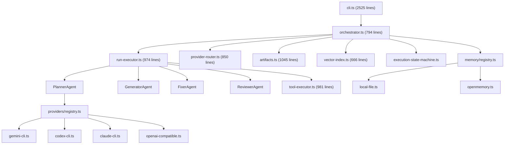
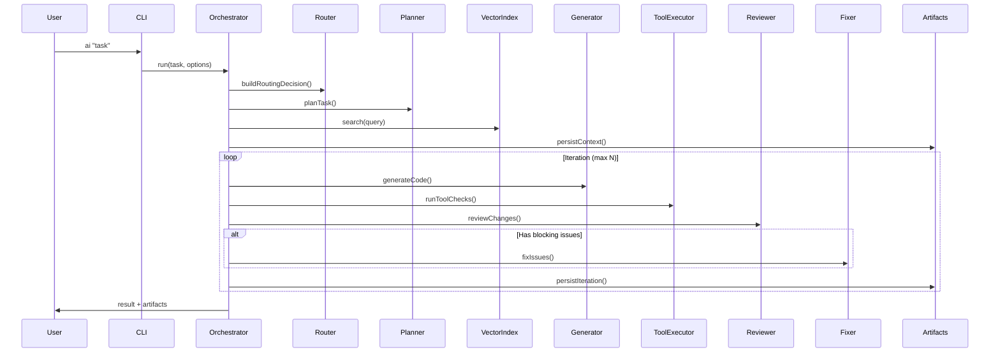

# AI-CODING-SYSTEM — Deep Technical Review

**Ngày đánh giá:** 23/04/2026  
**Phiên bản:** 0.1.0 (Beta / Internal Tool)  
**Reviewer:** Antigravity AI

---

## 1. Tổng quan dự án

AI-CODING-SYSTEM là một **CLI-first AI orchestrator** điều phối nhiều LLM CLI (Gemini, Codex, Claude) thông qua pipeline **Plan → Generate → Check → Review → Fix**. Hệ thống không gọi API trực tiếp mà thông qua các CLI đã cài sẵn, tạo ra một lớp trừu tượng linh hoạt cho việc chọn provider.

### Quy mô codebase

| Metric | Value |
|---|---|
| Tổng dòng source (TypeScript) | **~14,950 dòng** |
| Tổng dòng test | **~4,330 dòng** |
| Số file source | 36 files |
| Số file test | 19 files |
| Dependencies (runtime) | 3 (`blessed`, `@types/blessed`, `@xenova/transformers`) |
| Số commits | ~20 feature commits |

### Kiến trúc tổng quan

---

## 2. Điểm mạnh (Strengths)

### 🟢 S1 — Kiến trúc Orchestrator rõ ràng & Verified Execution
- Pipeline **Plan → Context → Generate → Tool Check → Review → Fix** là một mô hình **production-grade**.
- Code không chỉ được sinh ra mà còn phải qua lint/typecheck/test trước khi chấp nhận — đây là điểm vượt trội so với nhiều AI coding tool.
- Execution State Machine ([execution-state-machine.ts](file:///Users/trungnghianguyen/Documents/AI-CODING-SYSTEM/ai-system/core/execution-state-machine.ts)) thiết kế sạch, hỗ trợ `enter/finish/cancel/pause/skip` với async listener — cho phép observability tốt.

### 🟢 S2 — Artifact System & Resume/Retry
- Mỗi run được lưu đầy đủ: `plan.json`, `context.json`, `manifest.json`, `run-state.json`.
- Hỗ trợ **resume từ bất kỳ stage nào** (`ai retry last --stage reviewing`).
- Hỗ trợ `ai apply --from-artifact` để apply candidate đã save mà không cần rerun.
- Audit events cho mỗi apply action — rất tốt cho traceability.

### 🟢 S3 — Provider Routing thông minh
- **Adaptive Routing** dựa trên lịch sử run outcome, phân loại task (`docs`, `risky`, `general`).
- Hỗ trợ routing profiles (`fast`, `balanced`, `safe`) và cho phép role-specific override.
- `ai explain-routing` giúp developer debug routing decisions — UX rất tốt.

### 🟢 S4 — Zero-Config Tooling
- Auto-detect package manager (pnpm/yarn/npm).
- Auto-detect scoped scripts (`lint:changed`, `test:related`, etc.).
- Auto-detect workspace scope khi thay đổi nằm trong 1 package.
- Docker sandbox mode cho tool execution.

### 🟢 S5 — Context Intelligence nâng cao
- **Vector Search** với AST-based chunking (TypeScript compiler API) — mỗi chunk là 1 đơn vị logic (function/class).
- **Dependency Graph** phân tích import/export relationships.
- **Budget-aware context trimming** — pinned files giữ nguyên, low-value candidates bị cắt.
- Path-weight scoring cho search results.

### 🟢 S6 — CLI UX phong phú
- Interactive mode, dry-run, manual-review, pause-after-plan/generate.
- JSON output mode (`--json --save`) cho automation.
- Setup wizard, config presets, doctor command.
- Blessed-based TUI dashboard.

---

## 3. Điểm yếu (Weaknesses)

### 🔴 W1 — cli.ts là God File (2,525 dòng)

> [!CAUTION]
> File [cli.ts](file:///Users/trungnghianguyen/Documents/AI-CODING-SYSTEM/ai-system/cli.ts) chứa **2,525 dòng** trong 1 file duy nhất, bao gồm: argument parsing, command routing, interactive session, setup wizard, print formatting, JSON output, và tất cả display logic.

**Hậu quả:**
- Không thể test riêng từng phần CLI (arg parsing, display, commands).
- Rất khó maintain và navigate.
- Coupling cao giữa display logic và business logic.

**Nghiêm trọng:** ⭐⭐⭐⭐⭐ (Critical)

### 🔴 W2 — Thiếu ESLint / Prettier / Lint Pipeline

Dự án không có linter hay formatter configuration:
- Không có `.eslintrc`, `eslint.config.js`, `.prettierrc`.
- Không có `lint` script trong `package.json`.
- Không có pre-commit hooks.
- Code style phụ thuộc hoàn toàn vào AI generators.

**Nghiêm trọng:** ⭐⭐⭐⭐ (High)

### 🟡 W3 — Test Coverage không đồng đều

| Module | Has Tests? | Test Quality |
|---|---|---|
| orchestrator.ts | ✅ resume tests | Chỉ test resume, thiếu test `run()` |
| orchestrator-runtime.ts | ✅ | Tốt |
| run-executor.ts | ❌ | **Không có test trực tiếp** |
| tool-executor.ts | ✅ | Tốt (689 dòng test) |
| vector-index.ts | ✅ | Tốt (13K test) |
| provider-router.ts | ❌ | **Không có test** |
| artifacts.ts | ✅ | Tốt (621 dòng test) |
| cli.ts | ❌ | **Không thể test — God file** |
| context-intelligence.ts | ❌ | **Không có test** |
| execution-summary.ts | ❌ | **Không có test** |
| agents/*.ts | ❌ | **Không có test** |
| memory/*.ts | ❌ | **Không có test** |
| providers/*.ts | ❌ | **Không có test** |

> [!WARNING]
> `run-executor.ts` (974 dòng) và `provider-router.ts` (850 dòng) là 2 file critical nhưng **không có test trực tiếp**. Đây là risk lớn cho regression.

**Nghiêm trọng:** ⭐⭐⭐⭐ (High)

### 🟡 W4 — Agent Layer quá mỏng

Các agent files ([planner.ts](file:///Users/trungnghianguyen/Documents/AI-CODING-SYSTEM/ai-system/agents/planner.ts), [generator.ts](file:///Users/trungnghianguyen/Documents/AI-CODING-SYSTEM/ai-system/agents/generator.ts)) chỉ là thin wrappers (~50-70 dòng):
- Không có retry logic riêng.
- Không có input validation.
- Không có prompt versioning hoặc prompt template management.
- System prompt được hardcode bằng string concatenation.

Prompt engineering quality trực tiếp ảnh hưởng đến output quality, nhưng prompts hiện tại rất generic.

**Nghiêm trọng:** ⭐⭐⭐ (Medium)

### 🟡 W5 — Thiếu Token Cost Tracking

- Không track token usage per run.
- Không estimate cost trước khi execute.
- Không có budget warning khi context lớn.
- Adaptive routing không dùng cost signal.

**Nghiêm trọng:** ⭐⭐⭐ (Medium)

### 🟡 W6 — Single Language Bias (TypeScript/Node.js)

- Vector Index AST chunking chỉ hỗ trợ TypeScript/JavaScript.
- Tool execution auto-detect chỉ biết npm/yarn/pnpm ecosystem.
- Dependency graph chỉ phân tích `import` statements.
- Không hỗ trợ Python, Go, Rust, Java projects.

**Nghiêm trọng:** ⭐⭐ (Low-Medium)

### 🟡 W7 — `@types/blessed` là runtime dependency

Trong [package.json](file:///Users/trungnghianguyen/Documents/AI-CODING-SYSTEM/package.json#L24-L28), `@types/blessed` nằm trong `dependencies` thay vì `devDependencies`. Đây là type-only package, không cần ở runtime.

**Nghiêm trọng:** ⭐ (Low)

### 🟡 W8 — Thiếu Error Boundary tổng thể

- Không có centralized error classification.
- Không phân biệt rõ ràng giữa retryable errors vs. fatal errors ở mức orchestrator.
- Timeout handling phụ thuộc vào từng provider adapter riêng lẻ.

**Nghiêm trọng:** ⭐⭐⭐ (Medium)

---

## 4. Phân tích kiến trúc chi tiết

### 4.1 Data Flow

### 4.2 Module Coupling

Hiện tại `orchestrator.ts` phụ thuộc trực tiếp vào 11 modules (import statements). Đây là mức coupling **chấp nhận được** cho một orchestrator, nhưng nên giảm bằng dependency injection.

---

## 5. Plan cải thiện (Improvement Roadmap)

### Phase 1: Code Quality Foundation (Tuần 1-2)

> [!IMPORTANT]
> Phase này phải hoàn thành trước khi thêm feature mới.

#### 1.1 Tách cli.ts thành modules
- [ ] `cli/arg-parser.ts` — Parse CLI arguments
- [ ] `cli/commands/` — Mỗi command 1 file (`implement.ts`, `review.ts`, `fix.ts`, `setup.ts`, `config.ts`, `doctor.ts`, `runs.ts`, `retry.ts`, `apply.ts`, `explain-routing.ts`, `fix-checks.ts`)
- [ ] `cli/interactive.ts` — Interactive session management
- [ ] `cli/formatters/` — Print/display helpers (`result.ts`, `review.ts`, `runs.ts`, `routing.ts`)
- [ ] `cli/main.ts` — Entry point, chỉ wire commands

**Estimated effort:** 2-3 ngày  
**Risk:** Low (pure refactor, no logic change)

#### 1.2 Thêm ESLint + Prettier
- [ ] Cài `eslint`, `@typescript-eslint/parser`, `@typescript-eslint/eslint-plugin`, `prettier`
- [ ] Tạo `eslint.config.js` với strict TypeScript rules
- [ ] Thêm `lint` và `format` scripts vào `package.json`
- [ ] Fix tất cả lint errors hiện tại
- [ ] Thêm `lint-staged` + `husky` cho pre-commit

**Estimated effort:** 1 ngày

#### 1.3 Fix dependency classification
- [ ] Move `@types/blessed` sang `devDependencies`

**Estimated effort:** 5 phút

---

### Phase 2: Test Coverage (Tuần 2-3)

#### 2.1 Test các module critical thiếu coverage
- [ ] `provider-router.test.ts` — Test routing decisions, signal collection, adaptive scoring
- [ ] `run-executor.test.ts` — Test generation loop, finalization
- [ ] `context-intelligence.test.ts` — Test dependency expansion, budget trimming
- [ ] `agents/*.test.ts` — Test prompt construction, schema validation

**Estimated effort:** 3-4 ngày

#### 2.2 Integration test cho end-to-end flow
- [ ] Mock provider responses
- [ ] Test full `orchestrator.run()` path
- [ ] Test error recovery / retry paths

**Estimated effort:** 2 ngày

---

### Phase 3: Agent Quality (Tuần 3-4)

#### 3.1 Prompt Engineering System
- [ ] Tạo `ai-system/prompts/` directory
- [ ] Externalize prompts ra template files (`.md` hoặc `.txt`)
- [ ] Hỗ trợ prompt versioning (v1, v2...)
- [ ] Thêm few-shot examples vào prompts
- [ ] Cho phép users override prompts qua config

**Estimated effort:** 2-3 ngày

#### 3.2 Token Cost Tracking
- [ ] Thêm `tokenCount` estimate trước mỗi provider call
- [ ] Track cumulative tokens per run
- [ ] Surface token usage trong `ai runs latest/show`
- [ ] Thêm cost signal vào adaptive routing (`cost_weight` parameter)

**Estimated effort:** 2 ngày

---

### Phase 4: Reliability (Tuần 4-5)

#### 4.1 Error Classification System
- [ ] Tạo `errors.ts` với typed error classes:
  - `ProviderTimeoutError`
  - `ProviderResponseError`
  - `ToolExecutionError`
  - `ContextOverflowError`
  - `BudgetExceededError`
- [ ] Centralize retry decision logic dựa trên error class
- [ ] Thêm error metrics vào execution summary

**Estimated effort:** 2 ngày

#### 4.2 Parallel Execution Support
- [ ] Cho phép tool checks chạy parallel (lint + typecheck cùng lúc)
- [ ] Research khả năng parallel file generation cho independent files

**Estimated effort:** 2-3 ngày

---

### Phase 5: Ecosystem (Tuần 5-6+)

#### 5.1 Multi-language Support
- [ ] Abstract AST chunking interface
- [ ] Thêm Python support (tree-sitter-python hoặc ast module)
- [ ] Thêm Go support
- [ ] Auto-detect project language từ file extensions

#### 5.2 Plugin System cho Tool Execution
- [ ] Cho phép define custom tool executors
- [ ] Support cho pytest/ruff (Python), go test/golangci-lint (Go)

**Estimated effort:** 1-2 tuần

---

## 6. Ma trận ưu tiên

| Task | Impact | Effort | Priority |
|---|---|---|---|
| Tách cli.ts | 🔴 High | 2-3 ngày | **P0** |
| Thêm ESLint + Prettier | 🔴 High | 1 ngày | **P0** |
| Test provider-router + run-executor | 🔴 High | 3-4 ngày | **P1** |
| Prompt engineering system | 🟡 Medium | 2-3 ngày | **P1** |
| Token cost tracking | 🟡 Medium | 2 ngày | **P2** |
| Error classification | 🟡 Medium | 2 ngày | **P2** |
| Multi-language support | 🟢 Low (now) | 1-2 tuần | **P3** |
| Parallel execution | 🟢 Low (now) | 2-3 ngày | **P3** |

---

## 7. Tổng kết

### Điểm mạnh nổi bật
- **Verified execution pipeline** — hiếm thấy ở AI coding tools khác
- **Artifact + resume system** — production-grade state management
- **Adaptive routing** — intelligent provider selection dựa trên data
- **Zero-config tooling** — UX tuyệt vời cho developers

### Điểm yếu cần fix ngay
- **cli.ts God file** — blocking testability và maintainability
- **Thiếu linter/formatter** — code quality không được enforce
- **Test gaps** — 2 module critical (run-executor, provider-router) không có test

### Đánh giá chung

| Dimension | Score | Note |
|---|---|---|
| Architecture Design | ⭐⭐⭐⭐ | Solid orchestration pattern, good separation of concerns ở core |
| Code Quality | ⭐⭐⭐ | Clean TypeScript, nhưng thiếu linting enforcement |
| Test Coverage | ⭐⭐⭐ | Có test cho nhiều module, nhưng gaps ở critical paths |
| Developer Experience | ⭐⭐⭐⭐⭐ | Outstanding CLI UX với rất nhiều workflow options |
| Security | ⭐⭐⭐⭐ | Docker sandbox, path safety validation, clean-env mode |
| Extensibility | ⭐⭐⭐ | Provider registry pattern tốt, nhưng single-language bias |
| **Overall** | **⭐⭐⭐⭐ (3.7/5)** | **Strong beta tool, cần polish trước production** |

> [!TIP]
> Dự án đã có foundation rất tốt. Nếu tập trung vào Phase 1 (tách cli.ts + linting) và Phase 2 (test coverage), hệ thống sẽ sẵn sàng cho production use trong 2-3 tuần.
