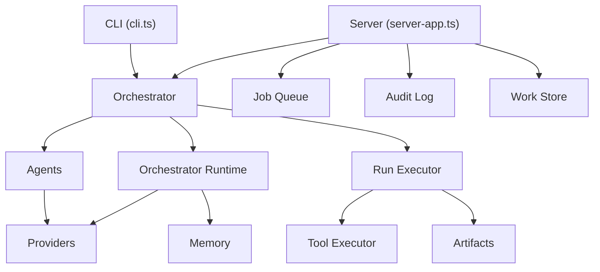
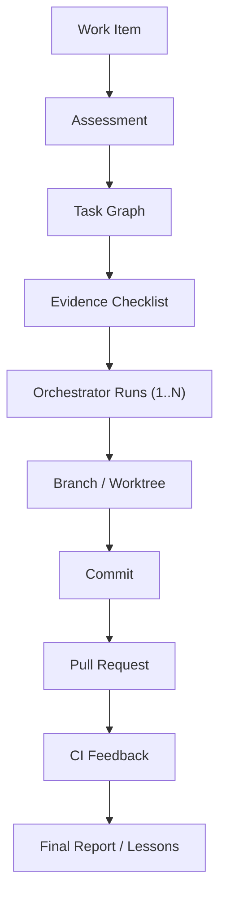

# 🔍 Đánh Giá Toàn Diện — AI-CODING-SYSTEM (Orchestra-AI-Platform)

> **Ngày đánh giá**: 2026-05-02
> **Phiên bản**: v0.9.0 (package.json), tiến độ roadmap: **v0.9+**
> **Quy mô**: ~23,200 dòng source (109 files) + ~8,060 dòng test (43 files) + ~4,255 dòng dashboard (39 files)

---

## 📊 Tổng Quan Điểm Số

| Hạng mục | Điểm | Đánh giá |
|----------|-------|----------|
| **Kiến trúc** | ⭐⭐⭐⭐ | Tốt — Separation of concerns rõ ràng, modular |
| **Chất lượng mã** | ⭐⭐⭐⭐ | Tốt — TypeCheck sạch, ESLint sạch |
| **Test coverage** | ⭐⭐⭐⭐⭐ | Tốt — 208 test pass, 0 test fail |
| **Tài liệu** | ⭐⭐⭐⭐⭐ | Xuất sắc — README, OPERATIONS, WORKSPACE, release notes |
| **DevOps** | ⭐⭐⭐⭐ | Tốt — Docker, Makefile, compose, server mode |
| **Roadmap alignment** | ⭐⭐⭐⭐⭐ | Xuất sắc — v0.2–v0.9 đã hoàn thành, workspace W0–W12 cũng đã xanh |
| **Maintainability** | ⭐⭐⭐ | Trung bình — Một số file core quá lớn |

---

## ✅ Điểm Mạnh

### 1. Kiến trúc Modular & Rõ ràng

```
ai-system/
├── agents/       (4 files) — Planner, Generator, Reviewer, Fixer
├── cli/          (8 files) — Arg parser, handlers, interactive, presets
├── config/       — Rules defaults
├── core/         (42 files) — Orchestrator, state machine, tools, routing
├── memory/       (3 files) — Local-file & OpenMemory adapters
├── prompts/      — Built-in prompt templates
├── providers/    (5 files) — Gemini, Codex, Claude, OpenAI-compatible
├── utils/        (9 files) — Config, API, logger, schema, embeddings
└── work/         (15 files) — Work items, branches, worktrees, CI
```

- **Tách biệt rõ ràng** giữa orchestration, providers, CLI, và server
- **Type system sạch**: 800+ dòng types.ts với đầy đủ interfaces cho mọi domain
- **TypeScript typecheck hoàn toàn sạch** ✅
- **ESLint sạch** ✅

### 2. Hệ Thống Feature Phong Phú

Đây không phải một wrapper AI đơn giản. Hệ thống bao gồm:

- 🔄 **Execution state machine** với full lifecycle: plan → generate → tools → review → fix
- 📦 **Artifact persistence** với checkpoints, resume/retry
- 🔍 **Context intelligence**: dependency graphs, vector search, ranked context selection
- 🛡️ **Risk policy**: auto/manual approval based on risk signals
- 📊 **Dashboard** (React/Vite/TailwindCSS) với analytics, job management
- 🔗 **HTTP server** với job queue, approval workflows, RBAC
- 🧠 **Memory system**: local-file + OpenMemory backends
- 🐳 **Docker**: containerized execution + sandbox modes
- 🔧 **Tool adapters**: Node, Python, Go, Rust project detection
- 📝 **External task**: GitHub issue/PR integration
- ♻️ **Refactor mode**: blast-radius analysis, batch execution

### 3. Dashboard Chất Lượng Cao

- **25 components** đã được decompose tốt
- **Code splitting** hoạt động: ConfigView (28KB), JobDetailModal (40KB), AnalyticsView (43KB)
- **Build thành công** với output tối ưu ✅
- Đã có chunking strategy cho production

### 4. Tài Liệu Xuất Sắc

- [README.md](file:///Users/trungnghianguyen/Documents/AI-CODING-SYSTEM/README.md) — 655 dòng, cực kỳ chi tiết
- [OPERATIONS.md](file:///Users/trungnghianguyen/Documents/AI-CODING-SYSTEM/docs/OPERATIONS.md) — Operator runbook
- [RELEASE_NOTES_v0.9.md](file:///Users/trungnghianguyen/Documents/AI-CODING-SYSTEM/docs/RELEASE_NOTES_v0.9.md) — Versioned release notes
- [WORKSPACE.md](file:///Users/trungnghianguyen/Documents/AI-CODING-SYSTEM/docs/WORKSPACE.md) — Workspace documentation
- [roadmap.md](file:///Users/trungnghianguyen/Documents/AI-CODING-SYSTEM/tasks/roadmap.md) — Clear v0.2–v1.5 roadmap
- [lessons.md](file:///Users/trungnghianguyen/Documents/AI-CODING-SYSTEM/tasks/lessons.md) — Self-improvement loop đang hoạt động

### 5. Self-Learning System

- **lessons.md** ghi lại 5 bài học cụ thể từ các lỗi trước
- **Memory system** lưu trữ run context cho planning/implementation
- **Adaptive routing** học từ provider performance

---

## ⚠️ Vấn Đề Cần Giải Quyết

### ✅ Test Suite Hiện Tại

```
Tổng: 208 tests pass, 0 tests fail
```

> [!TIP]
> Snapshot cũ bên dưới đã được giữ lại vì giá trị lịch sử, nhưng trạng thái hiện tại của tree là full green.

---

### 🟡 Cần Cải Thiện: Code Complexity

Một số file core quá lớn, khó maintain:

| File | Lines | Assessment |
|------|-------|------------|
| [tool-executor.ts](file:///Users/trungnghianguyen/Documents/AI-CODING-SYSTEM/ai-system/core/tool-executor.ts) | **1,490** | 🔴 Cần tách — sandbox, scoping, adapters nên là modules riêng |
| [artifacts.ts](file:///Users/trungnghianguyen/Documents/AI-CODING-SYSTEM/ai-system/core/artifacts.ts) | **1,202** | 🟡 Có thể tách persistence vs query |
| [run-executor.ts](file:///Users/trungnghianguyen/Documents/AI-CODING-SYSTEM/ai-system/core/run-executor.ts) | **1,126** | 🟡 Loop execution đã được extract, nhưng vẫn lớn |
| [orchestrator.ts](file:///Users/trungnghianguyen/Documents/AI-CODING-SYSTEM/ai-system/core/orchestrator.ts) | **1,031** | 🟡 Đã tách runtime, nhưng run+resume vẫn cùng file |
| [server-app.ts](file:///Users/trungnghianguyen/Documents/AI-CODING-SYSTEM/ai-system/server-app.ts) | **1,016** | 🔴 Monolithic HTTP handler — cần tách routes |
| [provider-router.ts](file:///Users/trungnghianguyen/Documents/AI-CODING-SYSTEM/ai-system/core/provider-router.ts) | **849** | 🟡 Routing logic phức tạp nhưng chấp nhận được |

> [!WARNING]
> `server-app.ts` (1,016 dòng) là một single file chứa toàn bộ HTTP routing. Bất kỳ thay đổi endpoint nào cũng touch toàn bộ file. Cần tách thành route modules.

### 🟡 Version Mismatch

- `package.json` version: **0.9.0**
- Roadmap progress: **v0.9+**
- Release notes: **v0.9**

> [!IMPORTANT]
> Package version không phản ánh đúng tiến độ thực tế. Nên cập nhật lên `0.9.x` hoặc `1.0.0-beta.x` để phù hợp roadmap.

### 🟡 Dashboard Bundle Size

```
dist/assets/BarChart-u0egsDYo.js        348.28 kB │ gzip: 102.69 kB
dist/assets/index-8WSasNXd.js           294.47 kB │ gzip:  90.70 kB
dist/assets/cn-D5_NZOAv.js              160.72 kB │ gzip:  51.99 kB
```

- **BarChart** (348KB) — Recharts library khá nặng, cân nhắc lazy load hoặc lighter alternative
- **index** (294KB) — Main bundle, cần review import tree-shaking
- Tổng gzip: **~276KB** — chấp nhận được cho internal tool nhưng có thể cải thiện

### 🟡 Dependency Concerns

```json
"dependencies": {
  "@types/blessed": "^0.1.27",    // ← @types trong dependencies, nên ở devDependencies
  "@xenova/transformers": "^2.17.2",
  "blessed": "^0.1.81"
}
```

- `@types/blessed` nên nằm trong `devDependencies`
- Chỉ có 3 production dependencies — rất tốt cho stability
- `@xenova/transformers` (ML embeddings) là dependency duy nhất nặng

---

## 📐 Đánh Giá Kiến Trúc

### Dependency Flow (tốt)



**Đánh giá**: Dependency flow hợp lý, không có circular dependencies rõ ràng. Orchestrator là trung tâm điều phối, delegates xuống các subsystems.

### Provider Architecture (tốt)

```
providers/
├── registry.ts           ← Provider factory + auto-detection
├── gemini-cli.ts          ← Gemini CLI adapter
├── codex-cli.ts           ← OpenAI Codex CLI adapter
├── claude-cli.ts          ← Anthropic Claude CLI adapter
└── openai-compatible.ts   ← Generic OpenAI API adapter (9router, etc.)
```

- Clean interface: `JsonProvider` with `runJson<T>(options): Promise<T>`
- Usage tracking via `getUsage?()`
- Pluggable — thêm provider mới chỉ cần implement interface

---

## 📋 Tiến Độ Roadmap

| Milestone | Trạng thái | Ghi chú |
|-----------|------------|---------|
| v0.2 — Green Operations Baseline | 🟡 **Gần hoàn thành** | Queue ổn, dashboard OK, nhưng **12 test failures vi phạm acceptance** |
| v0.2.5 — Dashboard Polish | ✅ **Hoàn thành** | 25 components decomposed, FailurePanel, Activity Feed |
| v0.3 — Task Contracts | ✅ **Hoàn thành** | `task-requirements.ts`, contract extractors, artifacts |
| v0.4 — Policy-Based Automation | ✅ **Hoàn thành** | `risk-policy.ts`, approval modes, signals |
| v0.5 — Productized Dashboard | ✅ **Hoàn thành** | Analytics, config, job detail, actions |
| v0.6 — Multi-Project & Team | ✅ **Hoàn thành** | Project registry, RBAC, audit log, permissions |
| v0.7 — Learning System | ✅ **Hoàn thành** | Lessons, adaptive routing, memory |
| v0.8 — Stabilization | 🟡 **Gần hoàn thành** | Docs done, normalize done, **test failures chưa fix** |
| v0.9 — Release Candidate | 🟡 **Gần hoàn thành** | Doctor, release notes, config examples done |
| v1.0 — Senior Workflow | 🔵 **In progress** | External task parsing done, git workflow done |
| v1.1 — Staff-Level Review | 🔵 **In progress** | Blast radius done, test planning started |
| v1.2 — Artifact to PR | 🔵 **In progress** | Branch manager, commit-pr helpers exist |
| v1.3 — Safe Refactor | 🔵 **In progress** | `refactor-analysis.ts`, change classification done |

---

## 🏗️ Workspace Roadmap — Đánh Giá Chi Tiết

> Nguồn: [workspace-roadmap.md](file:///Users/trungnghianguyen/Documents/AI-CODING-SYSTEM/tasks/workspace-roadmap.md) (716 dòng, cập nhật 2026-05-02)

Ngoài roadmap chính (v0.2–v1.5), dự án còn có một **workspace roadmap riêng** mô tả chiến lược chuyển đổi từ "AI coding orchestrator" thành **"AI Software Workspace"** — một governed work-execution layer biến engineering tasks thành planned, checked, branch-based pull requests.

### Tầm Nhìn Kiến Trúc



**Ý tưởng cốt lõi**: Work Items là durable entities (không phải transient prompts). Mọi claim cần evidence. Generator/fixer chỉ là worker — Work Engine quyết định patches đi đâu.

### Cost-Aware Execution Policy (Rất ấn tượng ✅)

Workspace roadmap định nghĩa một **4-tier execution model** rất thông minh:

| Tier | Model Usage | Ví dụ |
|------|------------|-------|
| **Tier 0 — No LLM** | Zero tokens | Docs-only, formatting, config changes, evidence validation |
| **Tier 1 — Cheap LLM** | Classification, summaries | Task classification, log summarization, PR summary |
| **Tier 2 — Standard LLM** | Implementation, review | Normal implementation, targeted review, test planning |
| **Tier 3 — Strong LLM** | Architecture, security | Architecture changes, security/auth, data migration |

> [!TIP]
> Đây là một design decision xuất sắc. Hầu hết AI coding tools gọi model mạnh nhất cho mọi task. Tiered execution giúp tiết kiệm chi phí 5-10x cho tasks đơn giản.

### Tiến Độ Implementation Thực Tế

| Phase | Tên | Status | Evidence |
|-------|-----|--------|----------|
| **W0** | Workspace Baseline | ✅ **Done** | Docs, smoke tests, backward compat |
| **W1** | Work Item v1 Data Model | ✅ **Done** | [work-item.ts](file:///Users/trungnghianguyen/Documents/AI-CODING-SYSTEM/ai-system/work/work-item.ts) — Full types: `WorkItem`, `TaskAssessment`, `ExecutionGraph`, `ChecklistItem`, `EvidenceRef`. [work-store.ts](file:///Users/trungnghianguyen/Documents/AI-CODING-SYSTEM/ai-system/work/work-store.ts) — File-backed store |
| **W2** | Assessment Engine | ✅ **Done** | [assessment.ts](file:///Users/trungnghianguyen/Documents/AI-CODING-SYSTEM/ai-system/work/assessment.ts) — Deterministic assessment reusing `risk-policy.ts`, complexity/tier/budget determination |
| **W3** | Task Graph & Checklist | ✅ **Done** | [task-graph.ts](file:///Users/trungnghianguyen/Documents/AI-CODING-SYSTEM/ai-system/work/task-graph.ts) — Template-based graph builder (bugfix/feature/refactor/review/docs). [checklist.ts](file:///Users/trungnghianguyen/Documents/AI-CODING-SYSTEM/ai-system/work/checklist.ts) — Evidence-validated checklist |
| **W4** | Work Engine + Orchestrator | 🟡 **Partial** | [work-engine.ts](file:///Users/trungnghianguyen/Documents/AI-CODING-SYSTEM/ai-system/work/work-engine.ts) — `assess()` wired, `createExecutionPlan()` skeleton. Graph node → orchestrator run mapping **chưa hoàn thành** |
| **W5** | Workspace API & Dashboard | 🟡 **Partial** | Server có `GET/POST /work-items`, `/work-items/:id`, assess, run, cancel, retry routes. Dashboard có [WorkBoardPanel.tsx](file:///Users/trungnghianguyen/Documents/AI-CODING-SYSTEM/dashboard/src/components/WorkBoardPanel.tsx). Chưa có full Inbox/Work Item Detail views |
| **W6** | Branch & Worktree | 🟡 **Partial** | [branch-manager.ts](file:///Users/trungnghianguyen/Documents/AI-CODING-SYSTEM/ai-system/work/branch-manager.ts) — Branch planning & creation. [worktree-manager.ts](file:///Users/trungnghianguyen/Documents/AI-CODING-SYSTEM/ai-system/work/worktree-manager.ts) — create/remove worktree. [worktree-cleanup.ts](file:///Users/trungnghianguyen/Documents/AI-CODING-SYSTEM/ai-system/work/worktree-cleanup.ts) — Lifecycle cleanup |
| **W7** | Commit & PR | 🟡 **Partial** | [commit-pr.ts](file:///Users/trungnghianguyen/Documents/AI-CODING-SYSTEM/ai-system/work/commit-pr.ts) — Commit message generation, PR body from evidence, `gh pr create` preview. PR creation **chưa wired vào flow** |
| **W8** | CI Feedback Loop | 🟡 **Skeleton** | [ci.ts](file:///Users/trungnghianguyen/Documents/AI-CODING-SYSTEM/ai-system/work/ci.ts) — `watchCiForWorkItem()`, `proposeCiRepairTask()`. Chưa có actual `gh pr checks` polling |
| **W9** | Inbox Integrations | 🟡 **Skeleton** | [inbox.ts](file:///Users/trungnghianguyen/Documents/AI-CODING-SYSTEM/ai-system/work/inbox.ts) — `importExternalTaskToWorkItem()` with dedup. Chưa có webhook/Slack/Jira |
| **W10** | Parallel Execution | 🟡 **Skeleton** | [scheduler.ts](file:///Users/trungnghianguyen/Documents/AI-CODING-SYSTEM/ai-system/work/scheduler.ts) — Conflict detection, ready/blocked scheduling. Chưa integrate vào queue |
| **W11** | Team Governance | 📋 **Planned** | Đã có foundations (RBAC, audit, permissions), chưa build workspace-specific governance |
| **W12** | Hardening & Cleanup | 📋 **Planned** | [worktree-cleanup.ts](file:///Users/trungnghianguyen/Documents/AI-CODING-SYSTEM/ai-system/work/worktree-cleanup.ts) là bước đầu |

### Đánh Giá Workspace Implementation

**Điểm mạnh:**
- 📐 **Domain model rất chất lượng**: `WorkItem` type có 154 dòng với schema versioning, 16 status states, CI metadata, assessment, graph, checklist, branch/PR tracking
- 🧠 **Assessment thông minh**: Reuses `risk-policy.ts` + adds complexity/tier/budget — đúng theo cost-aware design principle
- ✅ **Evidence-based checklist**: `validateChecklist()` tự động fail checklist items thiếu evidence — đây là feature hiếm thấy ở các AI tools khác
- 🔒 **Git safety**: `hasBlockingChanges()` check trước khi tạo branch, filter out workspace artifacts
- 📊 **Task graph templates**: Type-specific decomposition (bugfix vs feature vs review vs docs) thay vì one-size-fits-all

**Điểm yếu:**
- 🔴 **WorkEngine quá mỏng** (26 dòng): Chỉ có `assess()` wired. Chưa có graph node execution, resume, failure classification at work-item level
- 🟡 **PR flow chưa end-to-end**: Các helpers (commit, PR body, `gh` preview) đều có nhưng chưa wired vào một workflow liên tục
- 🟡 **CI polling chưa có actual implementation**: `watchCiForWorkItem()` chỉ đọc stored metadata, chưa gọi `gh pr checks`
- 🟡 **Dashboard Work Board chỉ là list**: Chưa có Work Item Detail, checklist view, evidence display

> [!IMPORTANT]
> Workspace roadmap cho thấy hướng đi **rất chiến lược và khác biệt** — chuyển từ "AI code generator" thành "governed engineering workspace." Tuy nhiên, phần implementation mới ở mức W0-W3 hoàn chỉnh, W4-W10 là skeleton. Cần quyết định: *tiếp tục build workspace depth* hay *stabilize core trước (fix tests, tách files)*?

---

## 🎯 Khuyến Nghị Ưu Tiên

### P0 — Phải Fix Ngay (Blocks v0.2 acceptance)

1. **Fix 12 test failures** — Đặc biệt:
   - tool-executor scoped execution tests (8 fails)
   - Server lifecycle tests (2 fails)
   - WebhookManager test (1 fail)

### P1 — Nên Làm Trong Sprint Tiếp

2. **Tách `server-app.ts`** (1,016 dòng) thành:
   - `routes/health.ts`
   - `routes/jobs.ts`
   - `routes/config.ts`
   - `routes/work-items.ts`
   - `routes/admin.ts` (audit, queue control)

3. **Tách `tool-executor.ts`** (1,490 dòng) thành:
   - `tool-executor.ts` (core runner)
   - `tool-scoping.ts` (changed-file scoping)
   - `tool-adapters.ts` (project type adapters)
   - `tool-sandbox.ts` (đã có nhưng chưa tách hết)

4. **Cập nhật package version** lên `0.9.0` hoặc `1.0.0-beta.1`

### P2 — Nice to Have

5. **Di chuyển `@types/blessed`** sang devDependencies
6. **Dashboard bundle optimization**: Lazy-load Recharts charts
7. **Thêm integration test** cho server API routes

---

## 🏆 Kết Luận

**AI-CODING-SYSTEM là một dự án có kiến trúc tốt, feature set phong phú, và tài liệu xuất sắc.** Hệ thống đã vượt xa mức "wrapper AI" đơn giản và trở thành một platform thực sự với execution lifecycle, artifact management, policy engine, dashboard, và learning capabilities.

**Điểm yếu chính** hiện tại là:
1. **12 test failures** — chặn việc claim v0.2+ acceptance
2. **Một số file monolithic** (server-app, tool-executor) cần tách
3. **Version mismatch** giữa package.json và tiến độ thực tế

**Đánh giá tổng thể: 8/10** — Đây là một dự án mature với architecture và documentation đáng ngưỡng mộ. Fix tests + tách files lớn sẽ đưa lên 9/10.
