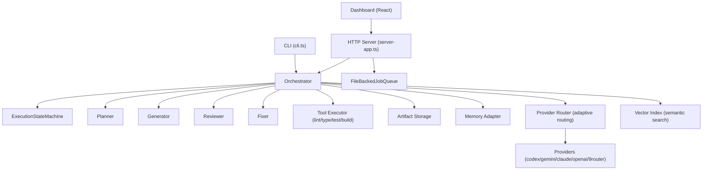
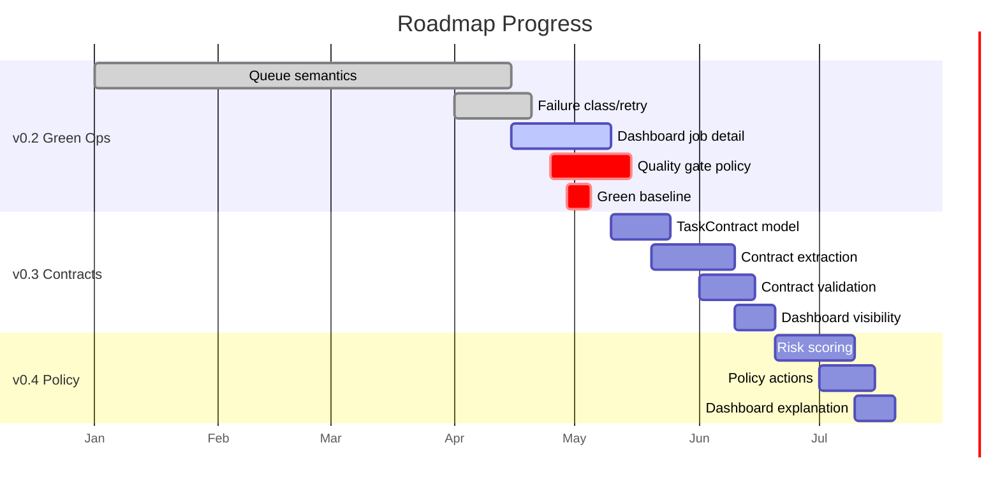

# AI Coding System — Full Review & Roadmap Assessment

Last reviewed: 2026-04-29

---

## 1. Codebase Overview

| Metric | Value |
|---|---|
| AI System core (TypeScript) | ~18,800 lines across 42 files |
| Dashboard (React/TSX) | ~4,150 lines across ~25 files |
| Test suite | ~6,200 lines across 30 test files |
| Total test count | 140 tests |
| Framework | Node.js + TSX, Vite + React dashboard |
| Package manager | pnpm monorepo (root + dashboard) |

### Architecture Summary



The system is a **real execution platform** — not a prototype. It has a well-structured lifecycle: plan → context → generate → tool-check → review → fix → write → memory store, with resume/retry, queue processing, artifact persistence, and dashboard visibility.

---

## 2. Baseline Gate Status

| Gate | Status | Notes |
|---|---|---|
| `pnpm run typecheck` | ✅ Pass | Clean — zero errors |
| `pnpm run lint` | ✅ Pass | Clean |
| `pnpm test` | ❌ **9 failures** / 140 total (131 pass) | See details below |
| `pnpm run dashboard:build` | ✅ Pass | Builds in ~500ms |

### Test Failures (9 tests)

**1. `server-queue.test.ts` — 1 failure (CRITICAL)**

The entire server-queue test file crashes with a **Node.js native assertion failure** before any test logic runs:

```
node::InternalCallbackScope::Close() — Assertion failed: (env_->execution_async_id()) == (0)
```

This is a Node v24.11.1 runtime-level issue with async lifecycle cleanup during `http.Server.close()`. **Not a code bug** — it's a Node runtime incompatibility. The test logic itself (4 test cases for queue enqueue/cancel/approval/mapping) is sound.

> [!WARNING]
> This is a known Node v24.x regression. The fix is either:
> - Pin to Node v22.x LTS, or
> - Refactor `closeServer()` to use `server.closeAllConnections()` before `server.close()`

**2. `tool-executor.test.ts` — 8 failures**

All 8 failures share the same root cause — **tool scoping feature tests that rely on `ToolExecutionScope` detection logic that isn't fully wired**:

| Test | Root Cause |
|---|---|
| auto-detects npm scripts | Scope detection returning wrong result |
| changed-file placeholders | Same — scope not applied |
| auto-detects scoped lint/test | Scoping logic incomplete |
| scopes to single workspace package | Package detection failing |
| prefers changed package lint script | Package scope precedence broken |
| pnpm workspace filters for multi-package | Multi-package scope missing |
| clean-env sandbox mode | Sandbox env passthrough not wired |
| dashboard package build scoping | Build scope for sub-package not matched |

> [!IMPORTANT]
> These 8 tests represent **Phase 1.4 (Quality Gate Policy)** work that was written test-first but the implementation hasn't caught up. The feature types (`ToolExecutionScope: "package" | "workspace"`) exist in `types.ts` but the executor doesn't fully use them yet.

---

## 3. Roadmap Assessment — Milestone by Milestone

### v0.2 — Green Operations Baseline

| Deliverable | Status | Evidence |
|---|---|---|
| Queue enqueue/cancel/retry/resume/clear | ✅ Implemented | `FileBackedJobQueue` with full lifecycle, `cleanupHungJobs`, `drain`, `stop` |
| `skip_approval=true` auto-run | ✅ Implemented | `resolveQueueRunApprovalMode()` in server-app.ts |
| Approval mode in job detail | ⚠️ Partial | Server returns it, dashboard shows basic status |
| Dashboard job detail (plan/files/checks/review/artifacts/retry) | ⚠️ Partial | `JobDetailModal` exists (27KB) but sections aren't cleanly separated; retry/contract/checks not visually distinct |
| Failure class + retry hint | ✅ Implemented | `FailureMetadata` type with `retryable` flag, `RetryHint` with stage + reason |
| Quality gates by affected area | ❌ Not implemented | Types exist (`ToolExecutionScope`) but executor doesn't route by package |
| Failed job shows actionable next step | ⚠️ Partial | `FailurePanel` exists but is minimal (2KB) |
| Baseline gates green | ❌ Not yet | 9 test failures |

**Assessment: v0.2 is ~60-65% complete.** Queue semantics and state machine are solid. The gaps are: (1) test failures blocking green baseline, (2) quality gate package scoping, (3) dashboard UX polish for job detail.

---

### v0.3 — Task Contracts

| Deliverable | Status | Evidence |
|---|---|---|
| `TaskContract` type model | ❌ Not started | No `TaskContract` type in `types.ts` |
| Contract extraction from task text | ⚠️ Proto-exists | `task-requirements.ts` has hardcoded Event Feed detectors (`isEventFeedFilterTask`, `asksNoHorizontalScroll`, etc.) — this is a **precursor**, not a generic system |
| Contracts in plan artifacts | ❌ Not started | Artifacts store plan/iteration/execution but no contract layer |
| Generator/reviewer/fixer receive contracts | ❌ Not started | Agents receive task + plan but no contract object |
| Deterministic contract checks | ⚠️ Proto-exists | `validateTaskRequirementCoverage()` checks specific UI patterns only |
| Dashboard contract visibility | ❌ Not started | No contract panel in `JobDetailModal` |

**Assessment: v0.3 is ~10% complete.** The `task-requirements.ts` module proves the concept works but is hardcoded to Event Feed UI patterns. The generic `TaskContract` model, extraction, validation, and dashboard integration are all unbuilt.

---

### v0.4 — Policy-Based Automation

| Deliverable | Status | Evidence |
|---|---|---|
| Risk scoring signals | ❌ Not started | No risk classification module |
| Risk classes (low/medium/high/blocked) | ❌ Not started | FailureClass exists but no RiskClass |
| Auto-run for low-risk | ❌ Not started | Only `skip_approval` toggle exists |
| Policy-based pause points | ❌ Not started | Only manual `pauseAfterPlan` |
| Dashboard policy explanation | ❌ Not started | — |

**Assessment: v0.4 is 0% complete.** However, the infrastructure for it exists: the routing system already has `RoutingSignal` and adaptive heuristics, the `ExecutionStateMachine` supports pause/resume at any stage, and the config system has extensible rules.

---

### v0.5 — Productized Dashboard

| Deliverable | Status | Evidence |
|---|---|---|
| Activity Feed | ⚠️ Partial | Main view shows job list with filters, but lacks real-time counts and live status |
| Job Detail | ⚠️ Partial | `JobDetailModal` (27KB) — large but needs sectioning (plan/contract/checks/review/artifacts/retry) |
| Project Health | ❌ Not started | No baseline gate status panel |
| Provider Performance | ⚠️ Partial | `AnalyticsView` (9.8KB) has charts but needs success/failure rate breakdown |
| Cost & Budget | ⚠️ Partial | `BudgetWarning` exists, `ExecutionBudgetSummary` type defined, but no trend/limit UI |
| Config Policy editor | ✅ Mostly done | `ConfigView` (28KB + 12KB) — substantial config editing UI |
| Actions (approve/reject/retry/resume) | ⚠️ Partial | `OperationsControl` (3.7KB) has basic actions |

**Assessment: v0.5 is ~30% complete.** ConfigView is surprisingly mature. The dashboard has all the major views but each needs deepening — especially Project Health (doesn't exist) and Provider Performance (needs real metrics).

---

### v0.6 — Multi-Project & Team Readiness

| Deliverable | Status | Evidence |
|---|---|---|
| Project registry | ❌ Not started | Server uses single `defaultCwd` |
| Per-project queues/artifacts | ❌ Not started | Single queue directory |
| Roles (viewer/operator/admin) | ❌ Not started | Only `isAuthorized` with single token |
| Audit log | ❌ Not started | — |

**Assessment: v0.6 is 0% complete.** Expected — it's far out on the roadmap.

---

### v0.7 — Learning System

| Deliverable | Status | Evidence |
|---|---|---|
| Repeated failures → new checks | ❌ Not started | — |
| User corrections as lessons | ⚠️ Manual | `tasks/lessons.md` exists but is manually maintained, not system-integrated |
| Planner reads lessons | ❌ Not started | Planner reads memory but not lessons file |
| Provider routing learns from history | ⚠️ Infra exists | Adaptive routing in `provider-router.ts` has `lookback_runs` and signal scoring, but no persistent learning loop |
| Dashboard exposes memory/lessons | ❌ Not started | — |

**Assessment: v0.7 is ~5% complete.** The adaptive routing infrastructure is a solid foundation.

---

## 4. Overall System Health Scorecard

| Dimension | Score | Details |
|---|---|---|
| **Type Safety** | 🟢 Excellent | Zero typecheck errors, rich type system (652 lines of types) |
| **Lint Quality** | 🟢 Excellent | Clean lint pass |
| **Test Coverage** | 🟡 Good with issues | 131/140 pass (93.6%), but 9 failures need fixing |
| **Architecture** | 🟢 Strong | Clean separation: types → core → agents → server → CLI → dashboard |
| **Execution Lifecycle** | 🟢 Mature | Full state machine, artifact persistence, resume/retry, provider routing |
| **Dashboard** | 🟡 Functional | All major views exist but need polish and missing views (Project Health) |
| **Documentation** | 🟡 Good | README (24KB), roadmap, lessons — but no API docs |
| **Roadmap Clarity** | 🟢 Excellent | Clean milestone progression, realistic scope per version |

---

## 5. Key Risks & Blockers

### 🔴 Critical

1. **Node v24.x runtime crash** in server-queue tests — blocks CI green. Either downgrade to Node v22 LTS or add `server.closeAllConnections()` workaround.

2. **8 tool-executor test failures** — these are test-first tests for Phase 1.4 features that aren't implemented yet. Either implement the scoping logic or mark tests as `todo` to unblock green baseline.

### 🟡 Medium

3. **Dashboard bundle size** — `BarChart` chunk is 348KB (102KB gzipped), `cn` utility chunk is 160KB. These will become a concern if the dashboard is served externally.

4. **`FailureClass` type has duplicates** — both `validation-failed` and `validation_failed` (snake_case vs kebab-case) exist in the union. Same for `budget_exceeded` vs `cost-budget-exceeded`. This will cause classification bugs.

5. **`task-requirements.ts` is hardcoded** — It only detects Event Feed UI patterns. This module needs generalization before Task Contracts (v0.3) can begin.

### 🟢 Low

6. **No API documentation** — The server has ~15 endpoints but no OpenAPI spec or docs.

7. **Single-file communities** — Dashboard components like `JobDetailModal` (27KB) are large and would benefit from decomposition.

---

## 6. Recommendations — Prioritized Next Steps

### Immediate (fix this week)

1. **Fix the 9 test failures to reach green baseline** — this is the gate for v0.2
   - Server-queue: Add `server.closeAllConnections()` before `server.close()` in test teardown, or pin Node v22
   - Tool-executor (8 tests): Either implement the package-scoping logic in `runToolChecks`, or temporarily mark as `test.todo()` with a note linking to Phase 1.4

2. **Normalize `FailureClass`** — pick one convention (kebab-case, which is the majority) and remove duplicates

### Short-term (Phase 1 completion)

3. **Phase 1.3 — Dashboard Operations UX** — Refactor `JobDetailModal` into clearly separated sections: Summary → Plan → Checks → Review → Artifacts → Retry. Make `FailurePanel` richer (show failure class, retry hint, suggested action).

4. **Phase 1.4 — Quality Gate Policy** — Implement the package-scoped tool execution that the 8 failing tests expect. This unlocks "dashboard changes run dashboard checks" behavior.

### Medium-term (Phase 2 kickoff)

5. **Phase 2.1 — TaskContract model** — Create the generic `TaskContract` type. Migrate the hardcoded patterns from `task-requirements.ts` into the first contract extractors.

6. **Phase 2.4 — Dashboard contract visibility** — Add a Contract section to JobDetailModal showing pass/fail per requirement.

---

## 7. Roadmap Evaluation Summary

The roadmap is **well-structured and realistic**. Key observations:

> [!TIP]
> **Strengths of the roadmap:**
> - Clear dependency ordering (v0.2 → v0.3 → v0.4)
> - Each version has concrete acceptance criteria
> - Scope is incremental — no version tries to do too much
> - v0.2 focuses on operational safety before adding new features

> [!NOTE]
> **Suggested adjustments:**
> - v0.2 should explicitly list "zero test failures" as an acceptance criterion (it implies it with "baseline gates green" but should be explicit)
> - v0.3 should note the migration path from `task-requirements.ts` to generic contracts
> - v0.5 should split Config View (already mature) from other dashboard views (need work)
> - Consider adding a v0.2.5 for "Dashboard Polish" between v0.2 and v0.3 — the dashboard gap is meaningful

> [!IMPORTANT]
> **The single most important action right now is fixing the 9 test failures.** Everything else in the roadmap is blocked by a non-green baseline. The roadmap itself says v0.2 acceptance requires "full baseline gates are green."

---

## 8. Progress Visualization


